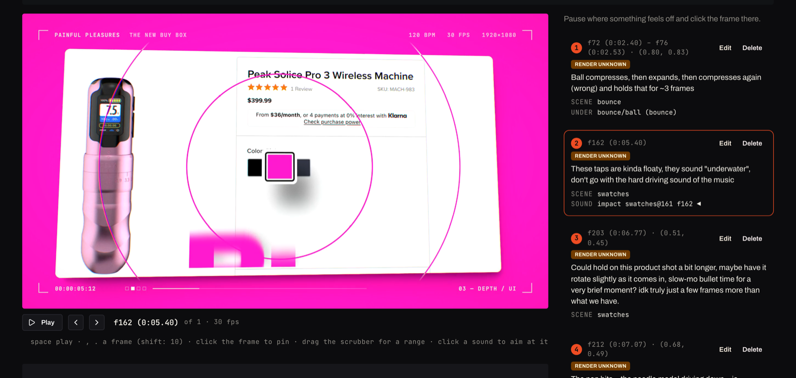
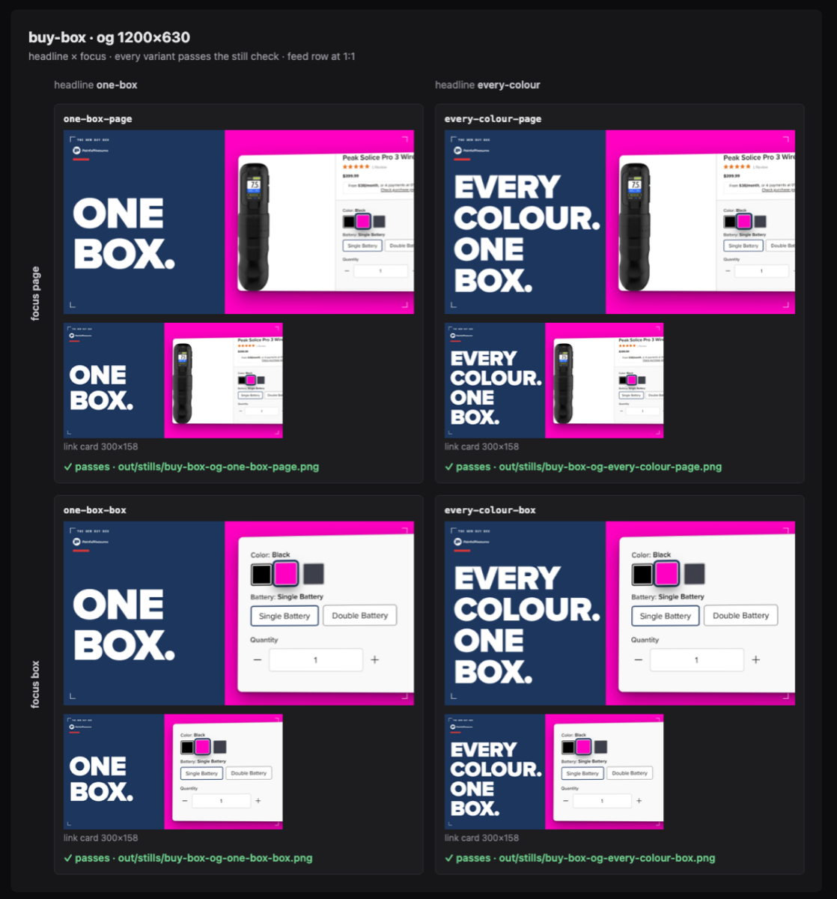

# media-studio

Tell your coding agent what video you want, and it makes it: the story, the shots, the motion, the voice, the music
and the mix, rendered to an MP4 you review in your browser. Built on [Remotion](https://www.remotion.dev), so every
frame is code, and a note like "hold that shot longer" is an edit and a re-render, not a redo.



## What you can make

- **Walkthroughs of real sites.** It films your pages itself: clicks, scrolls, typing, the states you'd show a
  customer, then zooms and highlights exactly the element each line is about.
- **Your product's real UI**, composed from your repo's own React components rather than screenshots of them.
- **Voiced explainers**, with each beat landing on its word, and **ads and teasers cut to music**, on the beat.
- **Generated images, music and footage** for what no capture can show, with each shot blocked out and approved
  before anything is paid for.
- **Stills**: OG images, YouTube thumbnails and social posts at every size, each checked for text that's cut off,
  hidden under a platform's buttons or lost against its background.
- **Sound**: effects synthesized to fit each moment, music fitted to the video's length, and a mastered mix.



## Getting started

You need a Mac with Node 24 and ffmpeg.

1. Clone it somewhere it can stay: `git clone https://github.com/GLips/media-studio.git`
2. Add the skills to Claude Code, once per machine:

   ```
   /plugin marketplace add <path to your clone>
   /plugin install media-studio@media-studio
   ```

3. Tell your agent: *"Set up media-studio."* It walks you through the rest, including the optional
   [OpenRouter](https://openrouter.ai) key that unlocks a real voice and generated media.

Then ask for a video, from any repo: *"make a 30-second teaser for our new pricing page."*

Your projects live in `work/`, a git repository of your own inside the clone, so they stay private while the studio
updates with a `git pull`.

## For agents

- **Setting up:** the `studio-setup` skill (`skills/studio-setup/SKILL.md`) installs it and walks your person through
  keys, their workspace, brand kits and product repos.
- **Making a video:** start with `video-kickoff`; `skills/video-kickoff/references/studio-map.md` maps every
  `studio` verb, a project's files and the studio's code. `studio <verb> --help` has the flags.
- **Working on the studio itself:** `CLAUDE.md`.

## License

MIT
