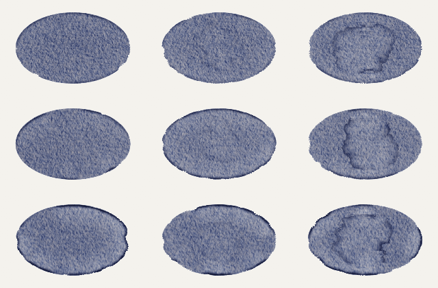

# Authoring paintings

Everything an agent needs to paint and animate with painting sources: the model, a worked example, planning colour and
light, the document's shape, how water behaves, units, media, time, costs, recipes, composition, a reference for the
engine's shapes, and checking. The types are the contract: `lib/paint/document/models/painting-document.ts` (the
document), `lib/paint/document/models/painting-properties.ts` (a source's property schema) and
`lib/paint/shot/models/shot-props.ts` (a scene's shot). docs/brush-engine.md is the engine underneath.

## What's built

Built: sources and `painting()`; property schemas and values; every check made without solving (Checking); a
document's tree, its sheets and each sheet's order (`painting-tree.ts`, `painting-sheet-program.ts`); the evaluation
diff; `layersOf`, `bracket` and `dissolve`, and the problems a shot's load reports in a plane's selection
(`paintedSourceProblems`); the shot's types; `studio paint check` and `studio paint diff`; and the solver, for
every sheet of a document, clocked washes and their prefixes included, each own sheet laid as a cut-out of its paper,
seen through `studio paint still` and `studio paint check --solve`, each at a scene second with `--at`; posing before
painting by a similarity (a place, a turn, a scale), the marks mapped and their fields, ragged edges and noise read
where they were planned; a document that wraps across x, down y or both (`wrap: 'x' | 'y' | 'xy'`); a layer's or
group's `reveal`, its finished paint shown over time at the selection's `at` (Time); and a layer's film read back
through a selection's prefix, its coverage or its picture (`paintingFilmCoverage`, `paintingFilmPicture`).

`<PaintedShot>` and `<PaintedShotCanvas>` draw a shot in a scene: painted, picture and three planes far to near
under the camera and its lens, on one canvas or several among HTML, a clear back over HTML behind the first; pin and
cover lays (`shot-placement.ts`), the page read as each frame draws (`shot-dom-points.ts`); occurrences and
their motion (nodes hang from their nearest enclosing node, a paintless group's included, clocks chaining);
visibility, a group's fading all it holds as one and a card fading with its owner; rigs (Composition), a cel swap
re-solving nothing; instanced planes, many items sharing a few finished variants, each blurred along its own travel;
`alphaOf` masks; per-plane
`clock` and `sourceClock` holds; dissolves and `bracket`, each end solved and laid once and their pictures summed by
weight, a rig posing every end alike; painted textures, paintings a three plane's objects wear, drawn at each frame's moment (Painted textures);
`warm`; and the cost report, each frame's and the warm's, in a profiling render. **NEW** marks behaviour the brush
engine (the recipe path, docs/brush-engine.md) lacks too; unmarked behaviour is how it already paints.

That is everything in the language: every shape the types above hold paints, draws and checks. What the checks
refuse (Checking and diagnostics) they refuse as wrong, never as not yet built. Outside the language, a shot gives
a profiling render its cost report but no timed stages: ENGINE §8's buckets (`stamp paint solve`, `… lay`, `… masks`
and the rest) aren't built yet.

## The model

1. A painting source is a `*.painting.ts` module: a pure factory returning a `PaintingDocument`, and a property schema
   if it takes values.
2. A document is a paper, a medium and a tree of layers; a layer holds washes; a wash holds applications, each one
   mark or run of marks (paint, water or a lift) through one tip. Papers, brushes and mixes are values written where
   they're used; share them as TS constants.
3. A sheet is one wet history: every application painted on it, whichever layer it's in, lands in the sheet's order
   (unclocked work first, in document order; then clocked work by its times), each at the earliest moment its `on`
   holds. **NEW**
4. Layers on one sheet share its water: a layer's paint lands into whatever is still wet there, and its water moves
   their open paint. Layer and group boundaries dry nothing. A later wash of a layer meets that layer's earlier washes
   set. Each layer keeps its own film, so colours of two layers glaze rather than mix. Separate sheets are separate
   paintings. **NEW**
5. A painting has no clock unless a wash declares one; a sheet keeps one, running at the sheet's `dryingScale`;
   unclocked work is always shown finished.
6. Scenes own clocks: they choose property values and sample times, and put finished layers on planes under a camera.
7. A sheet is one painting: a layer posed (place, pins, sway, flutter, rig) on a sheet it doesn't own is repainted
   into it at each distinct pose, its applications scheduled again where the pose puts them. Everything else a scene
   does (a plane's lay, the camera, visibility, a cut-out's moves, masks, reveals, dissolves) never re-solves paint; a property
   change does, and so does boil `reseed`.
8. The engine validates the document, solves each sheet's history once per distinct input, resuming from the first
   application that changed, and reports problems by key and path.

## Worked example

A watercolour sky floods wet, a treeline is charged into it while it still shines, and a hill is laid over it in a
later wash of the same layer. A pale cloud sits in a layer of its own. The scene shows it on one plane under a slow
push, raises the hill on sixes, and drifts the cloud.

The source is `lib/paint/document/models/meadow.painting.ts`; read it whole before writing your own. Its spec checks
it clean, `node cli/studio.ts paint check lib/paint/document/models/meadow.painting.ts` prints its summary, and
`node cli/studio.ts paint still lib/paint/document/models/meadow.painting.ts` paints it to `meadow.png` beside it. It
exports `properties`, one quantised number (`hillTopPx`, 150..260 px on a 10 px step), and a default factory
`meadow({ hillTopPx })` returning a 640 × 360 px watercolour document on a cotton paper (`vvds-watercolor-canvas-3`
grain, absorbency 0.5) with two layers:

- `landscape`: wash `sky` holds `sky-flood` (a fill of the sky's box, run 30 px past the paper's edges, at water
  0.85 through the even `detail` brush) and `treeline` (a swelling stroke `on: 'wet'` through the `charge` round,
  clipped to the sky, at water 0.6); wash `hill` holds `hill-flood`, a fill through the `wash` brush of a swell peaking
  at `hillTopPx`, closed past the paper's sides and bottom.
- `cloud`: wash `cloud-wash` holds one feathered ellipse at strength 0.15.

The scene, as a project would write it (`scenes/meadow.tsx`, with its source in `scenes/meadow/`):

```tsx
// meadow.tsx: the meadow under a slow push. The hill rises 260 → 180 px over seconds 1–4, redrawn every 6 frames;
// each height is one evaluation, re-solving the root's sheet from the hill on. The cloud drifts there and back every
// 8 s, repainted into the root's paper at each new place. `warm` solves seconds 0–8 first.

import { paintCameraPlay } from '#lib/paint/animation/models/paint-camera.ts';
import { paintMotionPlay } from '#lib/paint/animation/models/paint-motion-compile.ts';
import { stampStage } from '#lib/paint/painting/models/stamp-stage.ts';
import { layersOf, painting, type OccurrenceMotionNode, type PaintedShotProps } from '#studio';
import * as meadow from './meadow/meadow.painting.ts';

/** The hill's top at scene second `t`, px, snapped to the source's 10 px step. */
function hillTopAt(t: number): number {
  const k = Math.min(1, Math.max(0, (t - 1) / 3));
  return Math.round((260 - 80 * k) / 10) * 10;
}

const landscapeAt = (hillTopPx: number) => layersOf(painting(meadow, { hillTopPx }), ['landscape', 'cloud']);

/** The cloud's occurrence on plane `meadow`: its motion node turns about the cloud's centre, held on sixes. */
const cloud: OccurrenceMotionNode = { id: 'meadow/cloud', pivot: { x: 200, y: 80 }, clock: { hold: 6 } };

export const meadowShot: PaintedShotProps = {
  camera: {
    // A back plane is checked as reaching everywhere: the stage needs a margin, 2 px or more, even. Its painting
    // must hold all the frame shows of it: the push in shows less, so a frame-sized meadow holds it.
    stage: stampStage({ width: 640, height: 360 }, 2),
    fov: 30,
    // No shutter: the film's, open half a frame (1/60 s at 30 fps). `shutter: 'shut'` draws every frame sharp.
    lens: { bloom: 0 },
    // Ease sits on the key it eases into.
    plays: [paintCameraPlay({ kind: 'move', keys: [{ at: 0 }, { at: 5, dolly: 0.08, ease: 'inOut' }] }, { clock: { at: 0 }, origin: 'push' })],
  },
  // The source reads its own held moment: the hill steps on sixes while anything the plane moves keeps the frame's.
  planes: [{ id: 'meadow', depth: 1, sourceClock: { hold: 6 }, source: (moment) => landscapeAt(hillTopAt(moment.at)) }],
  motion: {
    nodes: [cloud],
    plays: [paintMotionPlay(cloud, { kind: 'place', keys: [{ at: 0, x: 0, y: 0 }, { at: 4, x: 60, y: -4, ease: 'inOut' }] }, {
      clock: { at: 0, loop: { period: 4, mode: 'pingpong' } }, origin: 'cloud drift',
    })],
  },
  warm: { from: 0, to: 8 },
};
```

The scene component is `({ t }: { t: number }) => <PaintedShot shot={meadowShot} t={t} />`, wrapped as a project's
other scenes are; the shot needs only `t`, in scene seconds.

What lands, and why it looks as it does:

| Application | Lands at (model s) | Why then | What you see |
|---|---|---|---|
| `sky-flood` | 0 | first, no `on` | flat blue wash, walled by its crisp outline, wetness 0.85 wherever the even `detail` brush touched |
| `treeline` | 0 | `on: 'wet'` holds at once: its core lies on the flood's full contact, all of it above watercolour's shiny 0.7 | earth paint feathers into the wet sky, about 0.5 × 26 ÷ 2 = 6.5 px sigma: a soft treeline. Its water 0.6 leaves the sky's 0.85 as it was |
| `hill-flood` | 203.901 | a later wash of `landscape` starts on the first 1 ms step once the layer's earlier washes have set: the sky's 0.85 water at watercolour's 240 s a full wash, absorbency 0.5, set by 203.9 s | earth fill with a crisp edge; where it crosses the sky it lands by watercolour's layering law (below) |
| the cloud's fill | 203.901 | next in the root sheet's order, at its predecessor's time: a layer boundary dries nothing, but the sky under it has set and the hill's wet flood lies below it | a pale feathered ellipse, its own film glazed over the sky |

Within one layer, a later wash over set paint lands by the medium's layering law. Watercolour mixes with pickup 0.5:
where the sky covers fully, the hill keeps half the sky's films and replaces half. That reads as a blend, not an
optical glaze. For films that stack (the sky showing through a transparent hill), put the hill in a layer of its own
with `on: 'dry'` on its flood (recipe 12): a layer boundary dries nothing, so without it the hill would land at 0 into
the wet sky and mingle with it. Changing `hillTopPx` re-solves from the hill on: `sky` comes earlier in the root
sheet's order and keeps its solve, and the cloud, after the hill, is painted again. `studio paint diff` says so before
anything solves (Checking).

The cloud lies on the root's sheet, which it doesn't own, so the scene's drift repaints it into that paper at each
new place: its grain stays still and its edges shift a little from solve to solve. Each place schedules the cloud
again where it lies; with no `on`, it lands at the same time wherever it is. Its node's hold of 6 sets how many
places, and so how many solves, a second, and `warm` solves them before the first frame. Given `sheet:
{kind: 'own', paper}` it would instead be a cut-out carrying its own paper and grain, moved without a solve.

## Planning colour and light

Paint is pigment in films on paper, not colour stacked by alpha. Plan the lights, what mixes and what stays clean
before writing a wash:

- **Light is the paper.** Watercolour is transparent: a light colour over a darker wash barely shows, and a glaze
  takes its look from what's under it. Reserve every light (a sun, a lit rim, a lamp's reflection) on each darker
  application that crosses it, one footprint shared as a TS constant: a region, crisp or feathered, or marks through a
  tip. A lift leaves a stain, and colour laid into it mixes with what stayed. Only `TITANIUM_WHITE` in a mix covers, as
  body colour.
- **One layer is one mixing film.** Within a layer an application mixes into the paint there, keeping up to half of it
  in watercolour, a fifth in gouache: a blue heart on yellow petals goes olive. In a later layer gouache covers and
  watercolour glazes (recipe 12). A layer holds 12 pigments.
- **A field grades pigment amounts.** A `Field<Mix>` mixes its ends' pigments along it, never their colours:
  ultramarine to rose passes through violet, blue to orange through grey, which the check warns of. Grade one mix's
  strength, change hue across layers, or charge the second colour into the wet flood (recipe 2).
- **Gouache lightens with white.** A weaker mix is a tint, still opaque, and any gouache dries 3–6 L* paler than
  written (Reference › Pigments); pale gouache laid as light reads chalky, pasted on. For glow, reserve the paper;
  for a veil, cap the film (`opacityCap`, Media: Thin films); for a near-black, mix a hex part at strength 1.
- **A big soft light on a dark ground** (a lit bank, a pool of lamplight on a road): watercolour only darkens, and a
  reserve or a feathered region always shows its edge, so a soft light reserved out of a dark wash comes out as strips
  or a cut-out. Lay the light as a gouache underpaint, its edge feathered or bled (gouache wants about 3.3 × the
  width you mean to read, Washes, layers and paper), then glaze watercolour over it and its dark surround in a later
  layer (recipe 12), which marries the two.
- **Haze is paint; glow is light.** A haze (mist over a far shore, warm air round a low sun) is a veil graded by a
  radial `load` on its fill (`{kind: 'radial', center, radius, inner: 0.6, outer: 0}`, Reference › Fields): no edge
  anywhere. Light that gives off light (a sun, a lamp, a lit window) is its emitter's `glow` and the lens's bloom
  (Reference › Glow): rings or discs painted round it read as rings or discs.

## The document

```
PaintingDocument {widthPx, heightPx, paper, medium, dryingScale?, wrap?, layers}
└─ layers: LayerNode[]            back to front
   ├─ LayerGroup {key, sheet?, medium?, reveal?, children: LayerNode[]}
   └─ Layer {key, sheet?, medium?, reveal?, washes: Wash[]}
      └─ Wash {key, clipTo?, prewet?, rim?, clock? | wetHistory: false, applications}
         └─ Application {stroke | stamps | fill and its geometry, brush, diameterPx, seed, charge,
                         key?, on?, at?, effect?, clips?, reserves?, resists?}
```

| Field | Type | Notes |
|---|---|---|
| `widthPx`, `heightPx` | px | Any size; (0, 0) is the top-left corner. Paint outside the rectangle is clipped away. |
| `paper` | `Paper` | The root's own sheet: `{color, image?, grain?: {image, scale, depth}, absorbency}`. |
| `medium` | `'watercolour' \| 'gouache' \| 'crayon'` | Default for every layer; a layer or group may override. Not per wash. |
| `dryingScale` | `number \| 'instant' \| 'never'` | The root sheet's: scene seconds per model second once a clocked wet wash starts its clock (Time). 1 when left out. An own sheet states its own. |
| `wrap` | `'x' \| 'y' \| 'xy'` | **NEW**: on every sheet `'x'` meets the left edge to the right, as round a cylinder; `'y'` the top to the bottom; `'xy'` both, a tile (Wrapping). Left out, nothing wraps. |
| `layers` | `LayerNode[]` | Back to front. |
| a layer's or group's `reveal` | `Reveal` | **NEW**: where and when its finished paint shows, at the selection's `at`; all of it when `at` is left out (Time: Reveals). |
| an application's `brush` | `{style, brush}` | A style's own brush name (Reference). The style is spelt `'watercolor'`, the medium `'watercolour'`. |
| a paint charge's `mix` | `Mix \| Field<Mix>` | `{parts: [{pigment, amount}], strength}`; a pigment is an appearance from `WATERCOLOUR_PIGMENTS` or a hex. |

Keys name the tree: layers, groups, washes, and any application you want named. They're unique across the document,
hold no `/`, `|` or whitespace, and don't start with `#`. Problems name an unkeyed application `<wash>.applications[i]`.
A deposit is named `<layer>/<wash>/<application>` by keys (`#i` for an unkeyed application, its place in its wash), and
that name seeds its colour and water: leaving a layer out or adding one repaints no other, while renaming a layer, wash
or application repaints its deposits. A group's key repaints nothing. Marks that land together are consecutive
applications, the later ones without `on`.

Seeds are separate strings. Equal seeds draw equal randomness: two applications with one seed repeat each other's
marks, and noise fields with one seed share one pattern. Give each application its own unless you want that.

Geometry: points are `{x, y}` (`StampPoint`) in paper px, x right, y down; angles are radians, positive turning
clockwise on screen. A `Region` is an ellipse or a polygon of `rings` read even-odd: a ring inside another is a hole,
one inside a hole an island, rings side by side a union. Rings never cross: compute an overlap's union in TS, or
write separate applications. A fill of several outer rings (rings side by side, or islands) is one application and
one deposit, holes bare: each ring is laid by its own placement, in written order, under the one charge and timing.
So a stand of trees in one charge is one fill; a tree in its own colour or moment is its own application. A stroke
has `subpaths`: pen-ups between them lay nothing, and the hand's profile counts the gap. To close a stroke's loop,
repeat its first point last; a ring never repeats it.

A module may import sibling TS modules, hold module-level constants and pure memos, and export anything else it
likes; its factory reads nothing but its values and imports. For seeded randomness use `seededRandom(seed)` from
`#lib/picture/motion/models/random.ts`. A source imports its types from `#lib/paint/document/models/painting-document.ts`
and `#lib/paint/document/models/painting-properties.ts`, and pigments from
`#lib/paint/materials/models/paint-watercolour-pigments.ts`; a scene imports `painting`, `layersOf`, `bracket`,
`dissolve` and the shot's types from `#studio`. A test, or a shot built in a `*-model.ts`, runs in plain Node, which
can't load `#studio`: it imports `painting` and `checkPaintingSource` from
`#lib/paint/document/models/painting-source.ts`, `layersOf` from `#lib/paint/document/models/painting-selection.ts`,
and `bracket`, `dissolve` and `paintedSourceProblems` from `#lib/paint/shot/models/shot-selection.ts`. A source one scene uses sits in that scene's folder
(`scenes/meadow/meadow.painting.ts`); one several scenes share is listed in `project.ts`'s `shared`, and the styles its
brushes name in its `styles` (docs/private-styles.md). Lint lets any `*.painting.ts` default-export its factory, and
holds it to a model's imports (no `#studio`, no I/O), since `studio paint check` loads it in plain Node. A helper
module it imports is a model too, so it is named `*-model.ts` (`scenes/meadow/hill-routes-model.ts`); a plain helper
is a scene helper, which a model can't import.

### Wrapping

`wrap` (**NEW**) joins a document's opposite edges on every sheet: `'x'` its left edge to its right, as round a
cylinder (a label, a lamp shade, a panorama a camera turns in); `'y'` its top to its bottom; `'xy'` both, a tile
that repeats each way, as a wallpaper or a floor. A stroke or flood running off one wrapped edge comes back on the
other, its water and wet stages (a bloom, a rim, a flood's spread) carrying across, and the paper's tooth, grain and
a pigment's clumps run on unbroken. On `'xy'` a mark by a corner lands by all four. Write marks past the edge in
plain px: a band from x 170 to 342 on a 256 px document runs across the seam, its last 86 px landing from x 0; a
bloom dropped at x 252 opens on both sides. A mark lands where it lies and a width either side, so nothing needs
painting twice.

The paper's grain tiles mirrored, and a mirrored tile meets itself only after its mirror, so on each wrapped axis it's
fitted in whole pairs: the tile is laid (width ÷ 2n) × (height ÷ 2m), each side the nearest to what it asks. Across x a
grain `scale` is laid at the nearest of 1 ÷ 2n of the width (0.5, 0.25, 0.167, …): scale 1, the styles' own, is laid at
0.5, half as wide; pick one of those values, and the check warns when the grain is laid more than a tenth off its scale.
Down y the tile's height, its width times its image's aspect, is fitted to the height the same way, so it's laid
anywhere from three quarters of what it asks to half as large again, and one asking more than half the height is laid at
half. On `'y'` alone the width follows: the grain keeps its aspect, not its scale. On `'xy'` each side is fitted on its
own, so the grain keeps its aspect only when the document's aspect is the image's times a small whole ratio: a square
grain at 0.5 on a 1920 × 1080 tile is laid 960 × 540, squashed to 16:9. At 0.1 it's laid 192 × 180, near enough. `studio
paint check --solve` and `studio paint still`, which load the image, warn when the height is laid more than a tenth off.

A wrapped sheet is painted with a margin past each side, wide enough for its widest mark and the water it carries,
rounded up to a power of two, and that width is part of its solve's key. So an edit that widens a brush or adds water
a little keeps every earlier wash's solve; one that carries the widest reach past the next power of two re-solves the
whole sheet, and `studio paint diff` says so.

What doesn't wrap: an axis `wrap` doesn't name, whose edges clip as ever, though the margin is laid past them too, so
water runs off them as off a larger sheet; a paper `image` (a photograph), laid as it is, so it meets itself at each
seam unless it tiles that way (the check warns); a deposit wider or taller than the document, whose fields (a fill's
load, a ragged edge's noise) jump where the one wrap round its middle ends; a long chain of wet-in-wet washes across a
seam, whose water the margin holds one wash at a time, so a faint seam may show after several; and a field reveal
(Reveals), read at each texel's own px with no period: a mark crossing a seam arrives in two halves, each at the field's
arrival on its own edge, unless the field arrives alike on both edges, which a sweep across the seam never does. `paint
check` warns, naming both arrivals: keep marks off the seam, or reveal by strokes, which wrap (recipe 38). The check
warns of a grain laid off its scale across x; down y the fit goes by the grain image's aspect, which only a solve
reads, so `--solve` warns of it. Wrapping is for a painting shown on a three.js surface as a painted texture
(Composition); on a flat plane it paints as any other, its seams at its edges.

## Water

### How it lands and dries

- Every charge lays through its brush's tip at `diameterPx`: paint, water and lifts alike.
- An application raises the paper's wetness toward its own `water`, as far as it touched:
  `now + contact × (max(now, water) − now)`. It never lowers it: water 0.6 over a 0.85 flood leaves 0.85. Overlaps
  take the wetter, never the sum.
- So a flood's wetness follows its contact: full up to a crisp or feathered wall, falling across a feather's or
  bleed's ramp, and lower in grain holes a textured brush skips. Gate later work on floods laid with an even brush
  (watercolour's `detail`, laid big); a textured one (`wash`, `filler`) lands its water in flecks, a third of the
  meadow's sky below shiny under `wash`, so an `on: 'wet'` into it can't hold.
- A lift soaks it up at once: `now × (1 − contact × strength)`. An `on` after a lift reads the paper drier.
- Between applications wetness only falls, at (0.5 + absorbency) ÷ drying per model second, by the medium of the
  sheet the water is on (the node that declared the sheet: the document's medium for the root). A 0.85 watercolour
  flood on absorbency 0.5 (rate 1/240) reaches damp 0.35 at 120 model s and dry at 204 model s: its damp window is 84
  model s.
- Water never spreads past where its brush touched. Every layer on a sheet shares that sheet's water (**NEW**); water
  never crosses sheets.
- Open paint of any layer on the sheet walks in water by itself: on flooded paper, sigma = medium spread × diameter ÷
  2, less as the paper is less wet, stopping at walls and dry gaps. Set paint never flows, however wet again; only a
  lift reaches it, by the medium's rewetting.

**Drying times.** Model seconds from water landing on dry paper until it's no longer shiny, until it's damp, and until
it's dry, by the laws above. Both media have no open time, so paint sets as its paper dries. Absorbency 0.3 takes 1.25
times as long as 0.5, and 0.7 takes 0.83 times as long. A sheet's `dryingScale` maps them to scene seconds (Time).

| Medium, water | absorbency 0.3 | 0.5 (the default) | 0.7 |
|---|---|---|---|
| watercolour 0.7 (its default) | never shiny, damp from 105, dry at 210 | never shiny, damp from 84, dry at 168 | never shiny, damp from 70, dry at 140 |
| watercolour 0.85 (a flood) | shiny to 45, damp from 150, dry at 255 | shiny to 36, damp from 120, dry at 204 | shiny to 30, damp from 100, dry at 170 |
| watercolour 1 (a bloom's drop) | shiny to 90, damp from 195, dry at 300 | shiny to 72, damp from 156, dry at 240 | shiny to 60, damp from 130, dry at 200 |
| gouache 0.4 (its default) | never shiny, damp from 7.5, dry at 60 | never shiny, damp from 6, dry at 48 | never shiny, damp from 5, dry at 40 |
| gouache 0.5 (a flood) | shiny to 15, damp from 22.5, dry at 75 | shiny to 12, damp from 18, dry at 60 | shiny to 10, damp from 15, dry at 50 |

Water landing on wet paper leaves it at the wetter of the two and dries from there: a drop of 1 on a flood that has
turned damp is damp again 156 s later (watercolour, 0.5). `studio paint check --solve` prints each wash's damp window and each bloom's (Checking).

### `on`: what an application waits for

Judged once, before the application lands, where the frame's pose puts it, over its core: the document's paper it
touches with contact 0.5 or more after its resists, clips and reserves, fringe excluded, each texel weighted by its
contact. Thresholds are the sheen of the sheet's medium, whose water it reads. A core texel the sheet's water never
reached counts against `wet` and `damp`.

| `on` | Holds when | Watercolour | Gouache | Use for |
|---|---|---|---|---|
| `wet` | 95% of the core is wetter than `shiny` | > 0.7 | > 0.4 | charging, wet-in-wet. Wetness only falls, so it never delays: it holds where the application lands, or the solve fails |
| `damp` | 95% of the core is at or below `damp` and above 0, at one time | ≤ 0.35 | ≤ 0.35 | blooms, backruns, soft lifts |
| `dry` | no core texel holds water or open paint | 0 | 0 | glazing within the wash, dry lifts, rewetting |
| left out | always | | | lands at its predecessor's time in the sheet's order, into whatever is still open |

The 95% share is provisional (**NEW**, as is the per-texel judge). An `on` that can't hold is an error: the solve
fails, naming the application, its share, where it fell short and what to do (Checking). A `wet` never delays: with it
or without, the application lands at its predecessor's time (or its `at`) into the same paper, so `wet` holds there or
the solve fails. Dropping it changes nothing but the check. A flood laid at the medium's default water (0.7, 0.4) is
never `wet`: flood at 0.85 or more in watercolour, 0.5 or more in gouache, for anything to charge into it. A core
whose wetness spans more than the damp band at once (a stroke along a wet and a drying passage) may never be `damp`
over 95%: split it. A `wet` falls short for one of the reasons below, and its failure names the one that fits what
its core's paper did. First, if more than 5% of its core met no water on the sheet, `never wetted on this sheet`: lay
it over the flood. Otherwise, the first of these:

- It came too late: at least as much of its failing core was laid shiny and has dried past it as was never shiny
  (`the water under it dried past shiny before it lands`). Something between the water and the charge waited (an
  `on: 'damp'` or `'dry'`, a wash starting once its layer had set): lay the charge sooner, ahead of what waits, or
  flood wetter. At a fixed `at`, move the `at` earlier.
- A lift took the paper's water with its paint (`it crosses glint, which took up the paper's water there`), named when
  a lift since the last drying meets where the core was never shiny: lay the charge before the lift, and lifts last in
  their wash, after every charge that crosses them.
- Nothing under it was ever above shiny (`nothing under it is shiny`): flood wetter before it.
- Else a charge reaching where a flood's water falls away (a small leaf, a narrow tier, or a second flood the shape of
  a crisp first, sitting on its rim) has the rim in its core (`part of its core lies where the water under it falls
  away`): inset it a few px, or feather it or the flood. A textured brush's flood fails alike between its flecks:
  flood with an even brush.

Between `damp` and `shiny` (satin) has no word: reach it with a fixed `at`. Crayon has no wet history, so `on` is
refused there. The sheet's water is every layer's: `wet` can hold over another layer's flood (**NEW**). On a moving
element `on` is judged again at every pose; leave it out and fix `at` where timing shouldn't depend on place.

A `dry` waits on the sheet, not on its own layer: it lands after everything before it in the sheet's order, every
layer's, once no water or open paint lies under its core, whichever layer laid it, and while it waits everything
after it waits too (Time: Scheduling). An ink line after a wet sky in the order lands after the sky's last
application, and where it crosses the sky's water, once that has dried. Layers meant to run on their own go on their
own sheets (`sheet: {kind: 'own', paper}`), or leave out `on` and land in order or at a fixed `at`.

### Techniques are applications

There's no effect object: every technique is applications with a charge. One label exists: `effect: 'bloom'` on a
water application, which the engine fails if it certainly can't bloom.

| Technique | Write | `on` | Acts only if | What you see |
|---|---|---|---|---|
| charge | paint, water 0.5–0.8 | `wet` | the paper is shiny under it (clear prewet water counts) | colour feathers in, sigma ≤ spread × diameter ÷ 2 |
| bloom | water stamps, water 0.9–1, `effect: 'bloom'` | `damp` | surplus water − wetness > 0.08 over open paint on workable paper; spread > 0; sigma ≥ 0.5 px | cauliflower edge; full from surplus 0.35; sigma = 1.5 × spread × diameter × surplus ≤ 24 px (the bloom chart, below) |
| backrun | one water stroke along a junction, water 1, `effect: 'bloom'` | `damp` (`wet` for softer) | as bloom | lobed edge pushed back along the stroke |
| soften | water stroke, water 0.3, along an edge | `wet` or `damp` | open paint under it | the edge evens out without flooding |
| wet lift | lift, strength 0.5–1 | `wet` (runs back) or `damp` (crisper) | open paint under it | soft light area; on shiny paper paint runs back up to min(16, spread × diameter ÷ 3) px, less on damp |
| dry lift (scrub) | lift, strength 1 | `dry` | the medium lifts | takes strength × rewetting of set paint (0.35 / 0.9 / an eraser's all), less the stain |
| rewet | water, 0.5–1 | `dry` | the medium takes water | wets the sheet's paper for later applications; set paint doesn't move |
| clear-water ground | the wash's `prewet` | — | — | an even soak at the wash's start, before its first `on` is judged; no brush texture |



The bloom chart (`lib/paint/document/models/bloom-rims.painting.ts`): crisp floods at water 0.85, and into each, once
it's damp, a drop 80 px across whose water lies 0.1, 0.2 and 0.35 over damp from left to right; each row is a wash of
`rim` 0.5, 1 and 2 from the top. Under 0.2 a bloom barely shows. The rim darkens a bloom's edge as it darkens the
flood's. A bloom rewets its footprint: water w landing at τ keeps it wet until τ + w × drying ÷ (0.5 + absorbency), so
a drop of 1 at 150 s is dry at 390 s (watercolour, 0.5).

Under `never` the paper never falls to damp, so a bloom there is `on: 'wet'` (or no `on`) with water 1 over a flood
at 0.85–0.9: surplus 0.1–0.15, a small bloom. An unlabelled application that can't act does nothing. A lift takes
strength × contact, so pressure changes it only through what the brush binds to pressure.

### Reserve, resist, lift

| | Reserve (masking fluid) | Resist (wax) | Lift |
|---|---|---|---|
| Written | `reserves: [footprint, …]` on an application or a wash's `prewet`, each a region (`{kind: 'region', region, edge?}`, crisp or feathered) or marks (a stroke or stamps through a tip, as a resist's) | `resists: [{footprints, amount}]` on an application, each footprint marks (a stroke or stamps through a tip): the brush's grain is what catches the peaks, and a region has none | a lift application |
| Acts on | that application (or prewet): paint, water or lift | that application's contact on the paper's peaks | its own layer's paint under it, and the sheet's water |
| Effect | excludes this application's deposition and transport: nothing of it lands there, its paint doesn't walk in, its core leaves it out. It does not remove water or paint already present | it keeps 1 − `amount` of contact on peaks; valleys still take paint; `on` judges the contact left | takes up to `strength` of what's liftable |
| Paint already there | untouched by this application; other applications' water still moves it | untouched | removed, leaving a stain |
| Edge | the footprint's: a region's crisp or feathered edge, or brushed tip and grain | broken by the grain | the brush's |
| Posed | with its layer; `anchor: 'paper'` keeps it still on the sheet | as a reserve | with its layer |
| Other applications | ignore it | ignore it | — |
| Leaves | bare paper, or whatever was painted before: a dry gap, with no rim | speckled paper | stain: films × pigment staining (watercolour, gouache); 4% pressed wax (crayon) |

To mask a whole wash, give each of its applications and its prewet the same footprints, a TS constant: that is how a
light stays paper (Planning colour and light), which no lift gives back clean. A reserve never erases. The recipe path's
keyed reserve targets (a reserve binding other applications by key) have no form here.

A lift spends the paper's water as well as its paint: it dries what it touches for whatever is laid after it there,
so a `wet` or `damp` charge over a lift made since the last drying can't hold (the solve names the lift). Charge
first and lift last in the wash. Light added into a dark ground (a lit window's reflection in a wet road) isn't a lift
and a charge: a lift takes little from a dark wash and leaves nothing to charge into. Lay it as gouache over the dark
(Planning colour and light).

## Washes, layers and paper

| Unit | Holds | Shares with siblings | Meets what came before |
|---|---|---|---|
| Application | one deposit at one painting time | its sheet's water and its layer's film | as wet as the sheet is then |
| Wash | a run of applications in its sheet's history, `prewet`, `rim`, an optional clock | its layer's film and its sheet's water | earlier washes of its layer set; lands by the medium's layering law |
| Layer | one film in one medium | its sheet and the sheet's water | the sheet as it is: its paint mingles with other layers' open paint in shared water (**NEW**); its film glazes over what's behind (Kubelka–Munk) |
| Group | children; a sheet and medium they inherit; a motion parent | nothing physical | its children, in order; dries nothing |
| Sheet | a paper: colour, image, grain, absorbency; one water, one order, one clock | every layer on it (one grain per sheet) | — |

A layer with no washes (`{ key: 'bare', washes: [] }`) is clear: its film lays nothing, and the check takes it as
meant. It's a rig's clear cel (Rigs), or the one layer of a bare-paper back (Composition). A layer left empty by
mistake is clear too, and shows as nothing in the look.

Layering law within a layer: watercolour and gouache mix (an application moves the pixel toward its own paint, keeping
pickup × coverage of what's there: 0.5 and 0.2); crayon stacks wax in the tooth, trading for older wax past 4/3 full
loads and filling the valleys only 60% there, so paper shows through several layers (about five fill it). A
transparent glaze over dry paint belongs in its own layer, its first application `on: 'dry'`. To hide what's behind
under fresh paper, put the layer on an own sheet (recipe 13).

Clips: an application's `clips` are regions it may land and its own paint walk in, each with its edges; several
intersect. A clip binds only its own application: a later unclipped water stroke still moves open paint across it,
so clip that stroke too, or reserve the area. Share a clip as a TS constant. `clipTo` names an earlier wash of the
same layer whose paint coverage, graded, clips this wash (texture inside a silhouette). A clip's or area's
`boundaries` give a stretch of its outline an edge of its own: every point within 1 px of one ring (or the traced
ellipse), either direction; two stretches along each other with different edges are refused.

Edges: `crisp` is a wall paint and water stop at, where a drying wash gathers its rim. `feather(widthPx)` keeps that
wall and rim, ramping coverage to nothing over `widthPx` inside the line; a feather wider than half a shape never
reaches full coverage. `bleed(reachPx)` removes the wall: a ramp `reachPx` wide past the line where paint and water
land fading and dry with no rim; a flood lays its paint over the whole ramp, which grades it. Either ramp is a
smoothstep in coverage, and how wide it reads depends on the paint (measured with a dark blue). In watercolour it
reads from 10% to 90% over about 0.6 of its width, its middle about 0.6 of a bleed's reach past the line (0.4 of a
feather's width inside it): for an edge that reads W px wide, give it about 1.6 W. Gouache's body colour hides at a
tenth of a load, so its ramp reads over only about 0.3 of the width, out at its thin end, a bleed's middle about 0.8
of its reach past the line (a feather's 0.2 inside it): give it about 3.3 W, and draw a bleeding shape's line inside
where its edge should read. Past the ramp, paint walks only into water already there; for a wetter loss, lay a
water stroke along the edge first. Two floods of one wash whose ramps overlap both land there, the later into the
earlier's water. So a silhouette that melts into wet paint is `bleed` on that stretch; a feather still walls it. Any
edge may be ragged: `roughness: {amountPx, featurePx, seed}`. `maxSpreadPx` on a paint charge caps how far that
application's own paint walks (**NEW**); like a clip, it binds nothing else. Bleed is refused on reserve and resist
footprints and in washes without wet history.

### Sheets

A sheet is one painting: one paper (colour, grain, absorbency), one cut edge, and everything lying on it painted into
it, on its real tooth.

| `sheet` | Lies on | Posed by a scene | Hides what's behind | Use |
|---|---|---|---|---|
| left out | its parent's sheet (the root's, at the top) | repainted into that sheet at each distinct pose (**NEW**): the grain stays still, edges shift a little from solve to solve, and its water meets the sheet's | no: it glazes | almost everything; an element crossing or touching a painted scene |
| `{kind: 'own', paper, dryingScale?}` | a new sheet of `paper`, which its layers lie on, drying at its own `dryingScale` (1), never another sheet's | the cut-out moves whole, paper and paint, with no solve; its layers posed apart from it are repainted into it | as far as its layers' paint landed, by its paper: a lift lightens paint and leaves the card whole | collage, a cut-out that slides, turns or bends |
| `{kind: 'scene'}` | the root's sheet, past any enclosing own sheet, at the root's `dryingScale` | as left out, on the root's paper | no: it glazes | a shadow under a cut-out, falling on the scene's paper. A shadow on a card it's glued to is a layer of the card beside it |

An own sheet's card is its paper cut round its paint, at twice the paint's gain: at each px it covers min(1, 2 ×
the most coverage any of its layers laid there, each times how much it shows). So the card is whole wherever its
paint is half laid, and it runs ahead of the paint through a soft edge's outer half: a `feather` or `bleed` outline on
a card shows a rim of its paper past the paint, and gouache, covering under 1 in its tooth, shows the paper through.
Tint the paper where a cut-out should read as paint alone (a gouache card, a sprig, a star): its paint's colour hides
both. Leave it pale where it should read as cut paper. Keep a card's outline crisp, and paint an edge meant to melt
into what's behind on its parent's sheet, where nothing lies under it but that sheet's paint. A cel a rig hides, or a
layer or view at visibility 0, takes its paper with it. The owner's visibility, a layer's or a group's, fades card and
paint as one, so one at 0 leaves nothing. A layer or group on another's card fades its own paint, and the paper only
its paint cut thins with it through the 2× gain, whole until it's half faded and gone at 0; where other paint on the
card lies under it, the paper stays.

Posing is a node's place, pins, sway, flutter or rig. On a sheet the occurrence owns, it moves finished paint.
Otherwise (**NEW**) it moves the marks before painting: strokes, stamps and fills are planned at rest, then each mark
goes where the pose puts it, scaled and turned with it, with its clips, reserves and resists, and the sheet's history
re-solves from its first application, on the paper there. Fields, ragged edges and boil wobble go with the marks; only
the grain stays still. Each pose schedules its applications again where they lie: an untimed `on` may land a step
apart from rest, and a fixed `at` whose `on` fails at a pose is an error at that frame. A clip, reserve or resist
with `anchor: 'paper'` stays on the paper, so a moving element passes behind it (recipe 31). Boil wobble always moves
finished paint. A node's or plane's hold sets how many poses, and so solves, a second; each distinct pose is cached.
A plane's `lay` moves the whole document, paper and all, without a solve. Shared-sheet paint stays within the
document rectangle: an element that leaves it needs a wider document or an own sheet.

The root is an own sheet of `paper` covering the document. An own sheet lies as far as its layers' paint does, one cut
edge round all of it, and its layers go with their owner onto one plane. **NEW**: everything on one sheet is one
history. Unclocked work is painted first, in document order (layer back to front, then wash, then application);
clocked work follows by time, a tie going to document order. Each layer keeps its film, but they share the water: a
rigged foot on the root's sheet charged into wet shallows mingles with them, and meets them dry once they've set
(recipe 32). Its water's work in the shallows stays when the foot is hidden, masked or faded: fade a group holding
both, or make the foot's presence a property. Paint meant to mix as one pigment shares a layer; two layers' colours
glaze. A plane paints what it selects: the same sheet's layers selected on two planes are two paintings. Separate
sheets are separate paintings: an own sheet's layers never touch the root's water. A sheet belongs to one document:
to paint an element from another source into a scene's paper, build its layers into the scene's document with that
source's TS functions. Paper grain is never carried by a flow: the language has no advected paper.

A sheet's grain is baked where its paint lies. Paint on a nearer plane, or on an instanced item, keeps the grain it
was painted on over the back plane's paper, which the camera moves differently. For grain that stays still under a
moving element, keep the element on the back plane's document.

`paintingTree(document)` (`painting-tree.ts`) gives a document's sheets, each `{owner, paper, edge, water,
dryingScale}` (`water` the medium its water dries by; `owner` null for the root's), and each node's sheet;
`paintingSheetOrders` (`painting-sheet-program.ts`) gives each sheet's order, its layers with their films' pigment
slots, and its clock, the one order the checks, the diff and the solver read. A sheet's clock runs at its
`dryingScale` from the earliest start among its clocked washes, a direct one's too, and only once a clocked wet wash
paints it.

## Units

| Quantity | Unit | Range | Default |
|---|---|---|---|
| lengths, `diameterPx`, `reachPx`, `widthPx`, `maxSpreadPx`, `featurePx`, `amountPx` | paper px | > 0 | — |
| angles: `rotation`, `direction`, `bend` | radians, positive clockwise on screen | — | 0 |
| `water` (paint or water charge) | the wetness the brush raises paper toward; 1 is flooded | 0..1 | medium's `defaultWater`: 0.7 / 0.4 / none |
| mix `strength` | share of a full load | 0..1 | — |
| mix part `amount` | relative amount | ≥ 0, one positive | — |
| a full load | the medium's `body` in unit films (1 unit film = a full watercolour wash) | 1 / 20 / 15 | — |
| fill `load` | share of a full load laid, per texel: on a flood the same factor as `opacityCap`; on a fill laid by strokes it scales each stamp, so overlapping stamps still build. What fades gouache toward no paint, where a mix's strength 0 lays white (Media: Thin films) | 0..1 (field allowed) | 1 |
| `opacityCap` (paint charges) | the most of a full load one application builds at each texel, across its stamps and subpaths: its film thins, so what's under shows through, and a dark colour lightens toward its tint, which can read as another hue (Media: Thin films); it multiplies what `load` lays (a flood at `load` 0.4 capped at 0.5 lays 0.2). Per application, per texel: overlapping applications add up, n of them to about n × cap | 0..1 | 1 |
| lift `strength` | share of liftable paint taken | 0..1 | — |
| resist `amount` | share of contact removed on peaks | 0..1 | — |
| `rim` | drying-line strength | 0..2 | 1 |
| `absorbency` | drinks water: a flooded wash dries in drying ÷ (0.5 + absorbency) model s | 0..1 | — |
| grain `scale`, `depth` | grain width ÷ document width; tooth depth | > 0; 0..1 | — |
| stroke `pressure`, point `scale` | share; share of the diameter | 0..1; > 0 | 1 |
| hand `fullProfileAt`, wobble `position` | brush diameters | ≥ 0 | 12; 0 |
| medium `spread` | brush diameters | — | 0.5 / 0.1 / 0 |
| medium `drying` | model s for a flooded wash at absorbency 0.5 | — | 240 / 120 / 1 |
| painting time | model seconds, from 0 at its sheet's start | ≥ 0 | — |
| clock `origin`, application `at`, `layersOf` `at`, `PaintMoment.at`, `warm` | scene seconds (`origin` may be `'set'`) | — | — |
| `dryingScale` (the document's, an own sheet's) | scene seconds per model second | > 0, `instant`, `never` | 1 |
| holds, boil `every` | animation frames at `camera.animationFps` | whole ≥ 1 | 24 fps |
| place `x`, `y`; rig pose `x`, `y`; boil `amount`, `scale` | document px | — | 0; 2.2, 45 |
| camera `pan` | `{x, y}` px the camera moves, as seen at depth 1: a positive x slides the picture left, a plane at depth d by x · zoom ÷ (d − dolly) (Where a plane point lands) | — | 0 |
| plane `depth` | depth units, larger farther; 1 is where a pan is measured | > 0 | — |
| `lay` `{placement: {x, y, rotation, scale}, pivot}` | frame px, radians, factor; pivot in document px | — | identity |
| camera `fov`, lens `bloom` | vertical degrees; frame px sigma | — | — |
| lens `shutter` | seconds open, about each frame's time; or `'shut'`, sharp on purpose | > 0, or `'shut'` (0 is refused) | the film's: half a frame at the composition's fps, 1/60 s at 30 |
| property `step` | the property's unit, a grid from `min` | > 0 | none |

## Media

| | Watercolour | Gouache | Crayon |
|---|---|---|---|
| Body (unit films per full load) | 1 | 20 | 15 |
| Lightens with | water (strength < 1 thins) | white (strength < 1 adds titanium white) | white wax |
| Paper contact | valleys; a dry brush catches the peaks (tooth 0.85) and skips the valleys | valleys; a dry brush catches the peaks (tooth 0.85) and skips the valleys | peaks (tooth 0.85); burnish reaches valleys |
| Layering in one layer | mixes, pickup 0.5 | mixes, pickup 0.2 | stacks: trades past 4/3 loads, filling the valleys 60% there |
| Spread / drying / rewetting | 0.5 d / 240 s / 0.35 | 0.1 d / 120 s / 0.9 | 0 / — / 1 (an eraser) |
| Sheen shiny / damp | 0.7 / 0.35 | 0.4 / 0.35 | — |
| `on`, water, prewet, rim | yes | yes | refused |
| Lift | wet: free paint; dry: × 0.35; stain stays | dry: × 0.9; stain stays | eraser: all but 4% pressed |

- **Watercolour**: transparent; granulating pigments (ultramarine 0.9, burnt umber 0.8, cerulean 0.8) settle into
  the grain by load and the paper's depth. Staining pigments (phthalos 0.9, quinacridone rose 0.8) resist lifting.
  Washed on a later canvas or a clear back, it glazes the HTML behind it per channel, keeping its hue (**NEW**;
  Composition, HTML among canvases).
- **Gouache**: opaque body colour; light over dark works. Weak mixes are tints with white, not thin washes: a pale
  mix (`strength` 0.16) still hides what's under it. For paint that lets what's under show, cap the film with
  `opacityCap` (on a flood `load` is the same factor), a thin film (Thin films, below): a full load is 20 unit
  films, so a strong pigment is still saturated at 0.16 (three washes deep). What's under shows through about half at
  0.1 of a full load, a fifth at 0.25 and about a tenth at 0.5 (a near-black hides by 0.1). A cap thins the paint,
  not the brush's edge: a hard `detail` brush capped is a fainter hard line. Gouache dries 3–6 L* paler than it is
  wet, so named pigments dry to Reference › Pigments' Gouache column, none darker than L* 35, a mix of them no darker
  than about L* 29, and strength below 1 adds white: for a near-black, mix a hex part at strength 1 (`'#10171f'`
  dries to L* 10). It barely travels (spread 0.1) and redissolves when lifted dry (0.9). A gouache layer over set
  watercolour covers by scatter.
- **Crayon**: no water and no wet history: every crayon wash says `wetHistory: false`. `burnish: true` on a paint
  charge presses wax into every valley. Crossing layers stack in the tooth. An eraser is a lift. Wax resists a later
  watercolour wash only where written: give that wash's applications `resists` with the crayon strokes as footprints.
  Unwritten, the wash glazes over the wax.
- **Ink**: no ink medium. Waterproof ink is line work in a direct wash (`wetHistory: false`, in any medium), a dark
  mix at strength 1, a fine brush; nothing later moves or lifts it. Put it in a layer below transparent washes, which
  glaze over it, and above opaque body colour, which would hide it. Ink that bleeds when rewet can't be written; fresh
  ink walking into a wet wash is a wet paint application on that sheet, landing while the wash is open.
- **Hex parts**: a hex is fitted as a pigment of its own, with no habits: a full load over white reads that colour in
  watercolour, and it is the masstone in crayon. Gouache fits it as its paint wet and dries 3–6 L* paler, so for a
  gouache colour to land on a hex, write one a shade darker.

Any brush paints in any medium. A dry-media brush lands by the dry law even in a wet wash and refuses stated water;
crayon refuses water whatever the brush, and a direct wash takes none by type. One sheet has one grain: a picture
mixing media on one paper picks one tooth. One sheet has one water too (**NEW**): it dries by the medium of the node
that declared the sheet (the document's, for the root), and `on` reads that medium's sheen. A gouache layer on the
root's watercolour sheet lands into watercolour water, while its own paint walks by gouache's spread. A wet wash on a
sheet a crayon node declared is refused: crayon keeps no wet history.

### Thin films

A capped film (`opacityCap`, or a flood's `load`) is thin paint over whatever lies under it, in any medium:

- **A dark colour lightens toward its tint**, which can read as another hue. `solid('#3b3fb4')` capped at 0.2 over
  cream reads a vivid cerulean (about `#3d86de`), not a pale indigo, and at 0.5 a saturated royal blue. Pick a capped
  colour by looking at it capped over its ground, not by its hex; for a shadow, grey the hex (`#2a2548`) until the
  shadow falls darker, not bluer, than what it lies on.
- **A cap is per application, per texel.** It bounds what one application builds at each texel, across all its
  stamps and subpaths, so one stroke crossing itself stays under it. Applications that overlap add up: n caps of c
  build about n × c. Plan a veil of many marks by their sum: fourteen halo discs at 0.035 lay about half a full load,
  an opaque disc in gouache, and a faint tint is 0.02–0.05 in all. A film meant to stay even is one application.
- **Gouache at strength 0 is titanium white.** Strength below 1 adds white (Lightens with, above), so a gouache mix,
  or a field's end, at strength 0 lays titanium white, not nothing: a mottle from blue to strength 0 is blue to
  white. Fade gouache toward no paint by the fill's `load` (a field grades it) or its `opacityCap`, keeping the mix's
  strength; the check warns of a mix at strength 0. Crayon is alike, with its wax white.

## Time

| Clock | Unit | Owner | Read by |
|---|---|---|---|
| painting time | model seconds, 0 at its sheet's start | the sheet | `on`, drying, workability |
| scene time | scene seconds | the scene | clocks, `at`, plays, `PaintMoment.at` |
| animation grid | frames at `camera.animationFps` (24) | the scene | holds, boil, plays' holds |
| film | frames at the composition's fps | the composition | render frames, warm spans, a lens's shutter left out |

- **Unclocked wash**: scheduled in painting time like any other, so its `on`s hold as they would; `at` is refused by
  type. A sheet's unclocked work is painted before any clock starts, in document order. Always shown finished; a
  sample time changes nothing.
- **Clocked wash** (**NEW**): `clock: {origin}`. Its sheet keeps one clock, running at the sheet's `dryingScale`: the
  document's for the root, an own sheet's for that sheet, 1 when left out. An own sheet never takes another sheet's
  scale, and a `scene` sheet is the root's, scale and all. No wash sets a scale, so every clocked wash on a sheet
  runs at one rate. The clock starts with the sheet's clocked wet work, at the earliest `origin`, the moment its
  unclocked work is painted; from there a model second takes `dryingScale` scene seconds. A scale alone times
  nothing: a wash without `clock` is unclocked on any sheet, and a sheet with no clocked wet wash dries in model time
  whatever its scale. A wash's `origin` is the earliest its first application lands: if earlier work on the sheet
  waits past it, the wash starts then, and its scene times say so. Nothing of the wash shows before its first
  application's scene time. Its prewet lands at its start, before its first application's `on` is judged.
  - `dryingScale` = scene seconds wanted ÷ model seconds needed. Model seconds to dry from w0 to w1 =
    (w0 − w1) × drying ÷ (0.5 + absorbency). A 0.85 flood to damp, watercolour, absorbency 0.5: 120 model s; to see
    that in 3 scene s, give the sheet `dryingScale: 0.025`, and its damp window runs from scene 3 s to 5.1 s.
  - A shown step is finished, so the scale doesn't change how a step looks. It changes when each application lands
    in scene time, which gates hold, the wetness each landing meets (how far a charge walks, a bloom's reach, the rim)
    and when the wash shows set.
  - A negative `origin` ages the sheet: −age × dryingScale opens the shot `age` model s in, and whatever landed before
    scene 0 shows finished from the first frame. A 0.9 flood on a sheet at 0.025 with origin −3.25 s is 130 model s
    old at scene 0, and damp from scene 0.05 s.
  - `origin: 'set'` starts the wash when every earlier clocked wash of its layer has set, found at solve and printed
    by `studio paint check --solve`. A fixed `at` stays an absolute scene second, checked at solve.
  - `dryingScale: 'instant'`: the first application lands at the start, each untimed one at its predecessor's scene
    time. Each application runs wet within itself, then the whole sheet sets before the next lands, so `on: 'dry'`
    holds at once and `wet`, `damp` and blooms over earlier paint are unreachable. A wash's prewet sets before its
    first application too. A wash sets at its last application's scene time.
  - `dryingScale: 'never'`: nothing on the sheet dries. Wetness stays where applications leave it: `wet` holds where
    it's above shiny, `damp` where it's at or below damp and above 0, `dry` only where no water landed. Paint stays
    open (Techniques: blooms). That includes the sheet's unclocked work, so on such a sheet no layer can start a wash
    after a wet one.
  - Under `instant` and `never`, `at` sets the scene time only.
- **Fixed `at`** (clocked washes only): never moves; must not precede its predecessor or the wash's start; its `on`,
  if any, must hold there, at whatever pose the frame gives. Two applications may share one `at`: they land in
  document order.
- **Direct washes** (`wetHistory: false`, crayon's only kind) may take `clock: {origin}`, so a drawing appears stroke
  by stroke at fixed `at`s; `on` is refused. A lift in one acts on the paper as in any wash: crayon's eraser takes
  up the wax under it. Any other direct application neither reads nor writes water, so the sheet's
  scale never changes how it looks, and a direct wash can't choose it. On a numeric clock, the time between its
  strokes still dries the water already on the sheet.
- **Scheduling** is forward: applications in the sheet's order, each at the earliest time at or after its predecessor
  where its `on` holds, judged against the simulated field. Earlier decisions are never revisited. The step is 1 ms
  of model time and the field is read per paper px (**NEW**). The sheet is one painter: an application waiting on
  `on` holds back everything after it in the order; to let other work land meanwhile, fix the waiting application's
  `at`, which orders it by that time.
- **Washes in one layer**: an unclocked wash may come before a clocked one, which meets it set. After a clocked wash,
  a wash must be clocked and start once it has set (`origin: 'set'` does that), building on the whole earlier wash.
  On a sheet whose clock is `never`, no wash can start after a wet wash of its layer.
- **Across layers** (**NEW**): layers on one sheet share its order and water. Their clocked washes interleave by
  time: a later layer's application at 2 s lands before an earlier layer's at 3 s, into whatever is wet. To have a
  layer meet another dry, start it once the other has set (`studio paint check --solve` prints set times) or give
  its first application `on: 'dry'`. A layer boundary dries nothing.
- **Showing a wash partway**: a selection's `at` shows its sheet's clocked applications scheduled at or before it,
  every layer's film finished there: `layersOf(p, ['landscape'], { at: moment.at })`. Each step shows dry while the
  next still lands into the wet history. Each distinct prefix is one solve; a plane's `sourceClock: { hold }` bounds how many.
  A held moment floors to its hold's grid: on threes, frames 0, 1 and 2 all show frame 0.
- **Warming**: `warm: {from, to}` on the shot is a span of scene seconds, not frames: `{ from: 0, to: 8 }` is the
  scene's first eight seconds. It solves the films of the render frames whose scene seconds lie in it (at the
  composition's fps), and of the moments they sample, before the first frame: prefixes, poses, property values,
  dissolve levels. Each painted plane solves once for each pairing of moments the span's frames read on its source
  clock and its own clock (its nodes' clocks run inside it), so a source held on sixes under a pose held on twos
  solves each pairing, not each frame. It reports what it solved and kept, and promises no residency: a span whose
  films outgrow the cache's budget evicts its beginning, and those frames solve again. Warm spans that fit. It warms
  only frames its scene shows: one running past its scene's end stops there, and every render prints a warning. A
  warm, and a frame's own solves, are held as long as they make progress: a shot fails once no solve has finished and
  its GPU has answered nothing for 90 s, naming the solve it was stuck in, and otherwise only past a two-hour backstop
  no real warm reaches. It prints a line for each warm solve and each slow solve of a frame. A painting project renders
  in one tab, so the warm runs once a chunk of frames (each chunk is a fresh browser); more `--workers` each warm
  again. A chunk whose page stalls or crashes (its heap filled by several cold solves, say) is drawn again in halves,
  each in a fresh browser with a warm of its own, down to a lone frame, which fails the render, named with its scene,
  if it fails again. A plane warms only at the frames it shows at, as a frame solves it (below): the rest count as hidden planes
  skipped.
- **The shutter**: each frame is seen with the lens's shutter open about its time. Left out, it's the film's: open half
  a frame at the composition's fps (a 180° shutter, 1/60 s at 30 fps, 1/48 s at 24), as a camera shooting the scene
  would be. `shutter: 'shut'` draws every frame sharp, on purpose: a graphic held crisp, a stop-motion look. A number
  is seconds, above 0; a shutter written 0 is refused, naming `'shut'`. Paint is solved once a frame, at its moment;
  what moves finished paint (the camera, a moving lay, nodes' plays, a rig drawn as pieces, a three scene's pose,
  instanced items keyed alike) is read at the shutter's two ends and blurs along its travel between. A hold reads the
  frame shown, not the second an exposure sees, so a drawing held on twos, a `sourceClock` hold and a boil's epoch are
  one pose through the whole shutter: blur never smears a hold or makes a boil step crawl, though the camera still
  moves through it. A pinned plane follows its element unblurred (Composition: Lay forms). In a fast frame the
  shutter costs no solve, only the reads at its ends and gathering the travel across the frame: a few percent of the
  frame's render (136 ms a frame shut, 140 ms open, on a 1920×1080 shot under a moving camera). A reference frame
  averages its 24 exposures shut or open. What it costs in paint is reach: a moving back's painting holds what both
  ends show (Camera).
- **A plane faded out costs nothing**: a frame solves a painted plane (or an instanced plane's variants) only when it
  lays something at one of the frame's exposures, every shutter sample in a reference render: its visibility above 0,
  and its ground paper or one of its layers above 0 through every group holding it. Otherwise it lays nothing and a
  mask reading it reads no coverage, so it isn't solved; the opaque back always shows. Fade a plane, or all its
  layers, out over the frames it isn't seen in and they skip its paint. A cel a rig's pose hides doesn't show either,
  so a plane whose only shown layers lie in cels its rigs' poses hide isn't solved. While any layer shows, its sheets
  are solved whole, the hidden layers' water included.
- **A drop landing in a wash** at a scene second: a timed water application on that wash's sheet with `at` (a bloom,
  if wanted), in the wash or a clocked layer of its own on that sheet, then its paint as the next application without
  `on`, so the bloom's label still checks water alone. A bloom rewets its footprint, so a later `damp` landing
  overlapping it waits or fails.
- **A shape that moves** (a wing beating, an arm swinging, a gate opening) is a rig, not painting time or a reveal:
  painting time lands and dries paint, and a reveal shows finished paint arriving where it lies, so neither moves
  what's already there. Paint each moving part on its own cels under one group and pose it by `rigs` (recipe 33). On a
  sheet the group owns it's drawn as pieces, paint and paper bending each frame with no solve; on shared paper each
  pose repaints it into the sheet's water.

### Reveals: finished paint shown over time

A layer's or group's `reveal` (**NEW**) says where its finished paint shows, and from when: an arrival time for each
texel, in the scene seconds a selection's `at` counts. At `at`, a texel shows once its arrival has passed, ramping in
over the reveal's `softS` seconds (0: at once, the front antialiased over a px). Left out, `at` shows every reveal
whole. A reveal is presentation: scheduling, the water, the solve and its checkpoints never see it, so a reveal edit
re-solves nothing (the evaluation diff lists it under its reveals), and an `at` moving through a reveal re-solves
nothing but the clocked prefixes it crosses.

- **Strokes**: `{kind: 'strokes', strokes, softS?}`, each stroke `{points, widthPx, from, to, cap?}`: a band `widthPx`
  wide round `points` (document px, joints round), its front advancing along them by arclength at constant speed,
  at the first point at `from`, the last at `to`. `cap: 'round'` (left out) reaches half the width past each end and
  arrives there with the end; `'flat'` stops square at it. Where bands cross, the earliest arrival shows the texel.
  Bands that have arrived cover a texel as their union, so bands laid edge to edge, or a path cut into pieces, close
  up with no seam (a texel's union reads its eight earliest partial bands). A texel no band covers never shows. An
  eased pull is its path cut into pieces, each at its stretch's pace: `paintingEasedRevealStrokes(points, {widthPx,
  from, to, ease, piecesPerSecond?, cap?})` (`#lib/paint/document/models/painting-reveal.ts`) cuts one, 30 pieces a
  second (a piece a frame at 30 fps) unless told otherwise. On a wrapped document a band wraps with its paint: one
  written past an edge comes back on the other, so a mark grows along its own path across a seam (recipe 38).
- **Field**: `{kind: 'field', base, delay?, softS?}`: each texel arrives at `base` plus `delay`, each a `Field<number>`
  of scene seconds (Reference › Fields), wherever paint lies. One of each kind:
  - constant, the whole film at once: `base: {kind: 'constant', value: 2}`, fading in over `softS` from 2 s;
  - linear, a flood rising: `base: {kind: 'linear', from: {x: 34, y: 132, value: 0}, to: {x: 34, y: 8, value: 2}}`,
    its foot at 0 s and its top at 2 s, held past both;
  - radial, a moon filling out: `base: {kind: 'radial', center: {x: 100, y: 70}, radius: 56, inner: 0, outer: 2}`,
    its centre first and its rim at 2 s;
  - noise, a petal's colour coming in blotches: `base: {kind: 'noise', scale: 14, seed: 'petal', a: 0, b: 1.2}`,
    blotches about 14 px across arriving over 1.2 s. A noise field names its `seed`.

  `delay` adds to `base`: a noise delay rags a rising flood's edge, a linear one sweeps a petal's blotches from its
  base to its tip (recipe 34, timed from a cue).

  A field varies across the document, not along a mark, and is read at each texel's own px, so it doesn't wrap: on a
  wrapped document a mark crossing a seam arrives in two halves unless the field arrives alike on the seam's two
  edges. `paint check` warns (`vine.reveal: a field arrives at x 0 at 0.00 s and at x 2048 at 1.00 s (y 359), so
  stem, crossing the seam, arrives in two halves: …`): keep marks off the seam, or reveal by strokes, which wrap.
- **What it cuts**: a layer's reveal cuts its own film. A group's cuts every film it holds, a nested reveal multiplying
  in, and the paper of every sheet it owns: an own sheet's card follows its revealed paint, as far as the revealed
  coverage reaches. Never the root's ground, never a sibling's film: on a shared sheet, what a hidden layer's water
  did to its neighbours' paint stays. It cuts pigment, before colour: each texel's opacity is taken times its share,
  so a half-revealed glaze lays as a thinner glaze, over HTML too.
- **Where it shows**: everything that reads a selection reads its reveals at the selection's `at`: a still
  (`studio paint still --at`), a plane, a plane over HTML, a painted texture (laid and re-mipped each frame its reveal
  moves), a rig drawn as pieces. Posed paint carries its reveal: it's read where its marks were painted (a warp by its
  fitted similarity). A film read back (`paintingFilmCoverage`, `paintingFilmPicture`) is read whole, as painted.
- **The overlap limit**: a reveal shows *finished* paint. Where applications overlap in one film, the texel shows the
  finished mixture from its earliest arrival, every later application in it included: ink crossing ink shows the
  crossing stroke the moment the first band reaches it, and yellow laid over blue can't arrive after the blue. Nor
  can a reveal show a lift taking paint up, or water moving it. For marks that must arrive in order where they
  overlap, give each its own layer and reveal; for paint whose arrival changes what it meets, time the applications
  (`at` on a clocked wash) and show the prefix.
- **Band widths**: share each path as a TS constant between the application and its reveal, and size its band by how
  wide the stroke reads: its brush's visible width, which `studio brushes describe` prints over the diameter, at the
  stroke's widest, plus its hand's wobble either side. `paintingStrokeVisibleWidthPx(application, brushOf)`
  (`#lib/paint/document/models/painting-reveal.ts`) works it out. It reads the brush, which a painting source can't
  resolve, so hold the source's widths to it in a test (recipe 26); the document never derives a band. Then look: a
  band too narrow trims the stroke's edge, so widen it until the edge reads whole. A band wider than the spacing of
  its rows reaches the paint beside it and shows that at its own time: a card of rows 112 px apart, banded 480 px wide,
  arrives in two or three big sweeps, not row by row. `paintingRevealBandPx(application, medium, {brushOf, wet?,
  sheetMedia?})` is the upper bound, everything the application can lay round its own subpaths: its stamps as
  compiled, scatter, wobble and a tip's span, blur and dual among them, at their farthest from the path, and in a wet
  wash (`wet`, true when left out) as far as its water carries paint in its medium or any of `sheetMedia`, the films
  it lands in. Its faint stamps and carried water mostly can't be seen (a 176 px gouache row's bound is 587 px): reach
  for it only where carried paint shows, a wet stroke's paint walking visibly past its edge. A straight edge needs no
  band: a linear field across it leaves the film its own fringe (recipe 35).
- **Held sources step it**: a reveal is part of the sampled painting, so a plane's `sourceClock: {hold: 6}` steps it on
  sixes with everything else its source reads. For a smooth reveal over stepped properties, leave `sourceClock`
  unheld, quantise the properties, and pass the continuous `moment.at` (recipe 36).
- **Cost**: a field is read where it's needed. A strokes reveal's arrivals are drawn once into a map over the box its
  bands reach (16 bytes a texel), kept in the GPU cache by the reveal, the film it cuts and its resolution; each frame
  reads it. Thousands of short strokes (a front of discs, each at its own beat) cost once; a map the size of the
  document costs its memory for as long as it's shown.

### Cues and painting time

A document's times (`origin`, `at`) are the seconds its selections' `at` counts: scene seconds when a plane passes
`moment.at`. Tying a painting to the video's timeline is one of two things, and they do different work.

**Land paint on a cue.** Fix the application's `at` from the project's timeline. `timeline.ts` resolves every
scene's cues, and `sceneCueSeconds` gives one scene's in seconds of its `t`. A painting source imports it from
models, not `#studio`, so it still loads in plain Node for `studio paint check`. A timed version of the meadow's sky
(its constants as in `meadow.painting.ts`), its treeline charging in on the scene's `trees` cue:

```ts
import { sceneCueSeconds } from '#lib/timing/timeline/models/scene-cue-seconds.ts';
import { timeline } from '../timeline.ts';

/** The meadow scene's cues, in seconds of its `t`. */
const CUE = sceneCueSeconds(timeline.clock('meadow'));

/** On the root's sheet, which the document gives `dryingScale: 0.1`: the flood shines until scene 3.6 s. */
const SKY_WASH: Wash = {
  key: 'sky',
  clock: { origin: 0 },
  applications: [
    {
      key: 'sky-flood', kind: 'fill', area: { region: { kind: 'polygon', rings: [SKY] } },
      brush: EVEN, diameterPx: 90, seed: 'sky-flood', charge: { kind: 'paint', mix: SKY_BLUE, water: 0.85 },
    },
    {
      key: 'treeline', at: CUE.trees, on: 'wet', kind: 'stroke', subpaths: [TREELINE], clips: [IN_SKY],
      brush: CHARGE, diameterPx: 26, seed: 'treeline', charge: { kind: 'paint', mix: EARTH, water: 0.6 },
    },
  ],
};
```

Moving the cue in `timeline.ts` moves the treeline's landing, and so what it meets: a later cue finds the sky less
wet, and past 3.6 s no longer shiny, where `on: 'wet'` can't hold and the solve fails: `the water under it dried past
shiny before its \`at\`: move the \`at\` earlier, or flood wetter before it`. `studio paint check <source> --solve` prints every landing's scene
time, so a scene can check it against its cues.

**Play a painting at another pace.** The selection's `at` is the painting's own time, so a scene maps its time into
it: `layersOf(p, ['landscape'], { at: (moment.at - CUE.paint) * 2 })` starts the painting on the `paint` cue and shows
it twice as fast. That retimes playback only: every prefix is the same solve, with the same wet interactions, shown at
another moment. To change what the water does (a charge meeting the sky wetter or drier), change the document's
times or its `dryingScale`, which re-solves.

## What changes, what runs, what it costs

| You change | Mechanism | Cost |
|---|---|---|
| a property value | factory runs; each sheet re-solves from its first changed application | evaluation, plus a solve from there through the end of that sheet's order |
| one wash's applications or mixes | its sheet re-solves from the first changed application | earlier applications on the sheet and other sheets hit the cache |
| a pigment new to a layer | the layer's film layout changes | its layer's history and everything after it on the sheet re-solve |
| a layer's `sheet` or `medium` | the sheets it leaves and joins re-solve from its first application | solves |
| `layersOf` `at` crossing an application | a new prefix of the sheet's clocked work | one solve per prefix, cached |
| a plane's `lay`, depth, camera, lens, an occurrence's visibility | composite only | per frame, no solve |
| the lens's `shutter` open, as the film's is when left out | a fast frame reads what moves at the shutter's ends and gathers its travel; a reference frame's 24 exposures sample the shutter shut or open | per frame, no solve: a few percent of a fast frame's render (Time: The shutter) |
| a plane's visibility, or every one of its layers', reaching 0 at every exposure of a frame | it isn't solved or laid | nothing that frame |
| motion plays, pins, sway, flutter, rig pose on a sheet the occurrence owns | the finished film warps or bends | per frame, no solve |
| the same on a sheet it doesn't own | its marks move; its sheet re-solves from its first application, scheduling again there | a solve per distinct pose of it and everything after it in the sheet's order (an unclocked element comes before all clocked work), cached; holds set the rate |
| marks `boil` (wobble) | warp by a displacement map per epoch | per frame, no solve |
| marks `boil` with `reseed` | re-placed and repainted | a solve per epoch |
| `dissolve` `k` | each end's films solved and its picture laid once, kept; the pictures summed by weight | per frame, no solve once both ends are; a rig pose on a shared sheet solves each end at it |
| a reveal, or the `at` it's read at | the film's cut, recomposed | per frame, no solve; a strokes reveal's arrival map drawn once per film and kept |
| instance count or poses | draws of shared films | per frame, no solve |
| a hold | fewer distinct moments | divides all of the above per second |

A solve is the expensive step: placing stamps and running a sheet's wet stages on the GPU. Its cost grows with the
stamps laid; nothing caps the marks in an application. A moving element repaints everything after it in its sheet's
order at each pose: put moving elements late in the document (in front), or on own sheets. Late in the document is late
only among unclocked work: on a sheet with clocked washes, unclocked work comes first wherever it's written, so an
unclocked walker repaints every clocked drop shown by then, at each pose. Clock its wash and it lands among them by its
time, repainting only what lands after it; or hold it. Quantise properties with `step` and hold planes so each distinct
value is reused, and warm the span a scene plays. A hundred timed applications are a hundred prefixes if a scene shows
each: hold the plane, or show fewer steps. `studio paint diff` shows what a property step re-solves; the cost report
counts what each frame and warmed span solved: `studio profile <project> --frames a:b --costs` tables it frame by frame,
a run of frames costing alike as one line.

## Recipes

| # | Look | Write | Watch for |
|---|---|---|---|
| 1 | graded sky | a flood whose `mix` is a field: `{kind: 'linear', from: {x, y, value: ZENITH}, to: {x, y, value: HORIZON}}` | grades pigment amounts, never colour: hues far apart pass through grey (the check warns), so grade one mix's strength and change hue across layers; more stops are more applications |
| 2 | wet-in-wet charge | flood at water 0.85+ with an even brush (watercolour's `detail`), then an application `on: 'wet'` of paint strokes | its core on the flood's full contact |
| 3 | bloom | after the flood, `{effect: 'bloom', on: 'damp'}` water stamps, water 1 | needs surplus > 0.08 over open paint; under `never`, `on: 'wet'` |
| 4 | backrun | `{effect: 'bloom', on: 'damp'}`: one water stroke along the junction | both sides must be damp at once; `on: 'wet'` gives softer scallops |
| 5 | soften one edge | a water stroke, water 0.3, along the edge, `on: 'wet'` | write it before anything waits for `dry` |
| 6 | lost edge | the fill's area `edge: {kind: 'bleed', reachPx: 40}` | past the ramp it needs water already there |
| 7 | crisp top, lost bottom | area with `boundaries: [{path, edge: {kind: 'bleed', reachPx: 30}}]`; a water stroke along it first for a wetter loss | every path point within 1 px of the outline |
| 8 | lifted clouds | lift stamps, strength 0.8, over the sky flood: `on: 'wet'` soft and running back, `on: 'damp'` crisper | staining pigments leave a ghost |
| 9 | scrubbed highlight | a lift application `on: 'dry'` | watercolour takes 35% of set paint per pass; gouache 90% |
| 10 | white sparkles | `reserves: SPARKLES` (stamp footprints) on each of the sea's applications | on a cut-out, a reserve holes the card to what's behind where no paint of the sheet landed |
| 11 | wax resist | crayon layer, then `resists: [{footprints: SAME_STROKES, amount: 0.8}]` on the wash's applications | white candle: the resist alone, no crayon layer |
| 12 | true glaze | the glaze in its own layer after the base layer, its first application `on: 'dry'` | without `on: 'dry'` it lands into the base's water and mingles; within one layer it mixes instead |
| 13 | body colour hiding a wash | a gouache layer on `sheet: {kind: 'own', paper: SAME_PAPER}` | weak gouache mixes are tints |
| 14 | dry brush | a style's dry brush (`{style: 'watercolor', brush: 'dry'}`) in a watercolour layer | dry brushes refuse stated water |
| 15 | granulation | ultramarine or burnt umber, a strong load, paper grain depth ≥ 0.3 | settle follows pigment, load and depth |
| 16 | soaked ground | wash `prewet: {region, water: 0.9}` then paint | laid at the wash's start; no texture; `reserves` keep it off |
| 17 | pen and wash | ink layer first, a direct wash, a fine brush, dark mix strength 1; washes in a later layer | the ink never moves |
| 18 | crayon pressed hard | paint charge `burnish: true` | crayon layers only |
| 19 | hill hiding a far range | the far range's applications take `reserves: [NEAR_HILL]` | inset the shape by the overlap you want |
| 20 | sponge-out through what's behind | a lift wash added to the layer behind | lifts never cross layers |
| 21 | wash painted on screen | clocked wash on a sheet at a `dryingScale`; plane source `(m) => layersOf(p, keys, {at: m.at})`; `sourceClock: {hold: 2}`; `warm: {from, to}` | each step shows dry; dissolve between prefixes to smooth the jump |
| 22 | a raindrop joining a puddle | on the puddle's sheet (its wash, or a clocked layer of the drop's own, at the sheet's one `dryingScale`), the drop's water stamp `at` its landing, then its paint with no `on` | a falling drop on another plane never joins by overlap |
| 23 | falling rain | an instanced plane: drop variants, `instances(m)` placing each under a lasting key | finished paint moving: no wet interaction; each drop blurs along its own fall |
| 24 | collage cut-out sliding | the layer with `sheet: {kind: 'own', paper}`; motion on its occurrence | its grain travels with it, as paper does |
| 25 | paint drifting over still paper | the layer left on its parent's sheet; motion on its occurrence, held | a solve per distinct pose, from its first application on |
| 26 | ink drawn on the beat | the ink layer's `reveal: {kind: 'strokes', strokes}`, its paths shared with its application, a stroke per beat; plane source `(m) => layersOf(p, keys, {at: m.at})` (below) | the overlap limit: where strokes cross in one film, the crossing shows with the first band; band widths held to the pen's visible width (`paintingStrokeVisibleWidthPx`) in a test, then sized by eye |
| 27 | animated property, smooth | `bracket(v, LEVELS)` → `dissolve(layersOf(lower), layersOf(upper), k)` | ghosting where edges move between levels |
| 28 | one painting, two places | two planes selecting the same evaluation and layers | each is its own occurrence |
| 29 | a drawing appearing stroke by stroke | a direct wash with `clock: {origin}` and an `at` per application, on any sheet: a direct wash has no say in its drying | or a reveal over the finished drawing (recipe 26), which pens each stroke along its length |
| 30 | an element fading | `visibility: {'plane/layer': (m) => …}` on the shot | a group's visibility fades it as one; a cut-out's owner fades its card with it; on another's card, the paper its paint alone cut goes as it does |
| 31 | an element passing behind a ridge on shared paper | its applications' `clips: [{region: ABOVE_RIDGE, anchor: 'paper'}]`; motion on its occurrence | the clip stays on the paper while the element moves |
| 32 | an element mingling with a wet wash as it moves | its layer on the wash's sheet (left out, or `scene` under an own sheet), posed by motion or a rig; its charge timed while the wash is wet (`at`, or `on: 'wet'`), later work `at` once it has set | a solve per pose from its first application; hiding it leaves its water's work in the wash: fade a group holding both |
| 33 | a figure that bends | its parts as layers (or groups) under one group; `rigs: {'plane/figure': {parts, pose}}` | on an own sheet the paint bends; on shared paper it's repainted per pose, into the sheet's water |
| 34 | a flood rising, a moon filling, a petal blotching in | a `field` reveal: `linear` up the flood, `radial` out of the moon, `noise` over the petal with a `linear` delay along it (below) | a field covers the whole film: past its ends a linear field holds, and paint outside the moon arrives at `outer` |
| 35 | a flat underline over HTML | the underline's own-sheet layer pinned to the words, revealed by a `linear` field along its length (below) | a field leaves the film its own fringe, where a band would trim it; its card follows its paint |
| 36 | a smooth reveal over stepped properties | no `sourceClock`; properties quantised by their `step`; `layersOf(painting(src, {stepped}), keys, {at: m.at})` (below) | held on sixes, the reveal steps with the rest; each stepped value is one solve, the reveal recomposes each frame |
| 37 | a light moving while the scene dissolves between lights | the light (a sun and its halo) a small painting on a nearer plane of its own, `lay: (m) => …` along its path, in gouache or with `TITANIUM_WHITE` to lie over the sky; the held lights reserve nothing for it | a light reserved in each held solve stays where that solve put it and fades in place through the dissolve, a ghost |
| 38 | a mark growing along its own path, a vine round a mug | the layer's `reveal: {kind: 'strokes', strokes}`, `paintingEasedRevealStrokes` over each of the application's own subpaths, written past the seam in plain px (below) | a field varies across the document, not along the mark, and tears where a mark crosses a wrapped seam (the check warns); bands wrap with their paint; band widths held to `paintingRevealBandPx` in a test |

Recipe 27 in full, as a plane of the worked example's scene (imports as there, plus `bracket`, `dissolve` and
`type PlaneProps` from `#studio`):

```tsx
/** Solved levels, px: five solves, then every frame is a blend of two of them. */
const LEVELS = [180, 200, 220, 240, 260];
const hillTopSmooth = (t: number) => 260 - 80 * Math.min(1, Math.max(0, (t - 1) / 3));
const smoothPlane: PlaneProps = {
  id: 'meadow',
  depth: 1,
  source: (moment) => {
    const { lower, upper, k } = bracket(hillTopSmooth(moment.at), LEVELS);
    return dissolve(landscapeAt(lower), landscapeAt(upper), k);
  },
};
```

Recipe 26, a skyline inked a stroke a beat from the `ink` cue, each stroke drawn over half a beat. The paths are the
application's and the reveal's; the band is the pen's visible width and a little more, as a look at the drawn line
asked:

```ts
import type { DirectApplication, PaintingDocument, Reveal, Subpath } from '#lib/paint/document/models/painting-document.ts';
import { sceneCueSeconds } from '#lib/timing/timeline/models/scene-cue-seconds.ts';
import { timeline } from '../../timeline.ts';

const CLOCK = timeline.clock('city'), CUE = sceneCueSeconds(CLOCK);
const SKYLINE: readonly Subpath[] = [/* one path a pen-down, in the order they're inked */];
export const LINES = {
  key: 'lines', kind: 'stroke', subpaths: SKYLINE, brush: { style: 'watercolor', brush: 'ink' }, diameterPx: 6, seed: 'lines',
  charge: { kind: 'paint', mix: { parts: [{ pigment: '#0b1024', amount: 1 }], strength: 1 } },
} satisfies DirectApplication;
/** The band round each path, px: no narrower than the pen reads (ink.test.ts), and 8 by eye at the line's edge. */
export const BAND = 8;
const INKED: Reveal = {
  kind: 'strokes',
  strokes: SKYLINE.map((points, i) => ({ points, widthPx: BAND, from: CUE.ink + i * CLOCK.spb, to: CUE.ink + (i + 0.5) * CLOCK.spb })),
};

export default function ink(): PaintingDocument {
  return {
    widthPx: 1920, heightPx: 1080, paper: COTTON, medium: 'watercolour',
    layers: [{ key: 'ink', reveal: INKED, washes: [{ key: 'pen', wetHistory: false, applications: [LINES] }] }],
  };
}
```

Its plane, the module imported as `ink`, reads each frame's moment: `{id: 'ink', depth: 1, source: (m) =>
layersOf(painting(ink), ['ink'], {at: m.at})}`. Its test resolves the pen's brush from the workspace's style, as a
still does, and holds the band to the pen's visible width, so a pen rebrushed wider fails the test before it shows
trimmed:

```ts
import assert from 'node:assert/strict';
import { test } from 'node:test';
import { paintingStylesBrushOf, readPaintingSourceStyles } from '#lib/paint/document/engine/painting-source-load.ts';
import { paintingStrokeVisibleWidthPx } from '#lib/paint/document/models/painting-reveal.ts';
import { painting } from '#lib/paint/document/models/painting-source.ts';
import * as ink from './ink.painting.ts';

test('the band is no narrower than the pen reads', async () => {
  const brushOf = paintingStylesBrushOf(await readPaintingSourceStyles([painting(ink)], 'the ink band'));
  assert.ok(ink.BAND >= paintingStrokeVisibleWidthPx(ink.LINES, brushOf));
});
```

Where two of its strokes cross, the crossing shows the moment the first band reaches it, the second stroke's ink
included: one film can't hold back paint a band already shows. A stroke that must be seen crossing another goes on a
layer of its own with its own reveal.

Recipe 34, three fields from the `drop` cue: a flood rising from the foot over two seconds, its edge ragged; a moon
filling out from its centre; a petal's colour coming in blotches, sweeping from its base to its tip:

```ts
const FLOOD: Reveal = {
  kind: 'field', softS: 0.25,
  base: { kind: 'linear', from: { x: 0, y: 1080, value: CUE.drop }, to: { x: 0, y: 400, value: CUE.drop + 2 } },
  delay: { kind: 'noise', scale: 120, seed: 'flood-edge', a: -0.2, b: 0.2 },
};
const MOON: Reveal = { kind: 'field', softS: 0.15, base: { kind: 'radial', center: { x: 1400, y: 260 }, radius: 110, inner: CUE.drop, outer: CUE.drop + 0.6 } };
const PETAL: Reveal = {
  kind: 'field', softS: 0.3,
  base: { kind: 'noise', scale: 14, seed: 'petal', a: CUE.drop, b: CUE.drop + 1.2 },
  delay: { kind: 'linear', from: { x: 138, y: 0, value: 0 }, to: { x: 194, y: 0, value: 0.8 } },
};
```

Recipe 35, an underline under the tagline's words, on a small document pinned by two points to the words' ends
(Composition), drawn left to right in half a second from the `underline` cue. A band round the stroke would trim the
bristles' fringe; a linear field along it leaves the film's own edge, and the own sheet's coral card follows the
paint. Its plane, on a canvas over the HTML, reads `(m) => layersOf(painting(underline), ['underline'], {ground:
'transparent', at: m.at})`:

```ts
const UNDERLINED: Reveal = {
  kind: 'field', base: { kind: 'linear', from: { x: 40, y: 0, value: CUE.underline }, to: { x: 480, y: 0, value: CUE.underline + 0.5 } },
};
const layer: Layer = { key: 'underline', sheet: { kind: 'own', paper: CORAL_PAPER }, reveal: UNDERLINED, washes: [UNDERLINE_WASH] };
```

Recipe 36, the worked example's meadow with a reveal on its cloud layer: the hill still steps by its 10 px `step`,
a solve a step, while the cloud's reveal moves every frame. The source is unheld, so the reveal reads the frame's
moment; held on sixes, as the worked example holds it, the reveal would step with the hill:

```ts
const smoothReveal: PlaneProps = {
  id: 'meadow',
  depth: 1,
  source: (moment) => layersOf(painting(meadow, { hillTopPx: hillTopAt(moment.at) }), ['landscape', 'cloud'], { at: moment.at }),
};
```

Recipe 38, a vine round a mug's 2048 px girth (`wrap: 'x'`), growing from its root at x 1700 along its stem in 1.5 s
from the `bloom` cue, easing in and out. The stem is written past the seam in plain px, its last 372 px landing from
x 0, and its reveal's strokes are its own subpaths, so the band crosses the seam with the paint and the stem grows on
unbroken. A linear field from its root to its tip would sweep across the mug instead, and the part past the seam,
read at x 0..372, short of the field's start, would arrive with the root:

```ts
import type { DirectApplication, Layer, Reveal, Subpath } from '#lib/paint/document/models/painting-document.ts';
import { paintingEasedRevealStrokes } from '#lib/paint/document/models/painting-reveal.ts';

const VINE: Subpath = Array.from({ length: 49 }, (_, i) => {
  const x = 1700 + 15 * i;
  return { x, y: 360 + 40 * Math.sin(x / 90), pressure: 0.8 };
});
export const STEM = {
  key: 'stem', kind: 'stroke', subpaths: [VINE], brush: { style: 'gouache', brush: 'round' }, diameterPx: 14, seed: 'stem',
  charge: { kind: 'paint', mix: { parts: [{ pigment: '#2f5a32', amount: 1 }], strength: 1 } },
} satisfies DirectApplication;
/** The band round the stem, px: held to its paint by a test, as recipe 26's is. */
export const STEM_BAND = 30;
const easeInOut = (u: number) => u * u * (3 - 2 * u);
const GROWN: Reveal = {
  kind: 'strokes',
  strokes: STEM.subpaths.flatMap((points) => paintingEasedRevealStrokes(points, { widthPx: STEM_BAND, from: CUE.bloom, to: CUE.bloom + 1.5, ease: easeInOut })),
};
const vine: Layer = { key: 'vine', reveal: GROWN, washes: [{ key: 'vine-paint', wetHistory: false, applications: [STEM] }] };
```

Each subpath grows over the same span from its own first point; a tendril off the stem takes its own `from`, when the
stem's front reaches its root.

## Composition

Before the first look:

- `project.ts` names in `styles` every style the shot's paintings brush with: a style it leaves out is refused by
  `studio paint check` and missing from the bundle.
- `studio paint check` passes on each painting source, at the values its scenes set: brushes, fill diameters, keys
  and order, without the GPU.
- Keys share one namespace across the whole document: a layer, a group, a wash and an application may not share a
  key, even in different layers (`hill` the layer, `hill-wash`, `hill-flood`). An element built twice by one TS
  function takes a key prefix as an argument. Keys stay flat because shots address `plane/layer` by them
  (visibility, rigs, motion nodes, masks).
- Planes run farthest first. With `<PaintedShotCanvas>`es, the back draws in the first, and each later canvas's
  planes all lie nearer than every plane of an earlier one.
- A rig names every layer under its group in one part's cels, a layer riding another (a gouache light on its
  watercolour) grouped with it as one cel, not named as a further cel (those are swaps, hidden at rest). Each skinned
  part's rest cel paints some of the rig on its own, not outweighed everywhere by the cels over or under it.
- `PaintedShotProps` is a module constant, or memoised: a new identity reloads the shot.

The camera's stage frame is the canvas's pixels. `<PaintedShot>` is an element the frame's size, one CSS px a frame
px, scaled to fill `box` (composition px; the whole composition when left out); its HTML children are laid out in
frame px. At rest, a plane's document px are frame px at any depth; depth only tells as the camera moves
(Reference). A stage px is measured from the frame's top-left; the margin lies at negative px and past the frame. A
plane's paint must cover what the camera shows of it: the camera build reports any shortfall. The back's painting
must also hold what its blur reads past the frame, about 3 × its sigma + 2 px each side, and whatever the camera's
move and shutter show of it; a back painted short of that is refused, naming the fix in the terms of its lay
(Camera).

| Concept | How | Notes |
|---|---|---|
| plane | `PlaneProps {id, depth, source, lay?, clock?, sourceClock?, masks?, canvas?}` | farther first; equal depths keep written order. With canvases (HTML among canvases), `canvas` names the plane's: the back's is the first, and a later canvas's planes all lie nearer than every plane of an earlier one (an instanced plane's at all its `depths`), else `<id>.canvas` is refused at load |
| back and nearer planes | the farthest non-instanced plane is the back, fixed at load: painted on paper, or a picture held everywhere; over HTML, a clear back (below). Nearer painted planes are clear film; picture and three planes lay premultiplied over what's behind | across painted planes: the white/black approximation `C + T × behind`, so a strong coloured glaze over coloured paint reads light. So a nearer watercolour plane tints what's behind it rather than hiding it: a bright far plane (a glitter, a lit pool) shows through its glazes. A gouache body under those glazes hides it. Nearer paint keeps its own grain (Sheets) |
| ground | a selection's `ground`: paper on the back, transparent elsewhere, when left out | the back is opaque, hiding HTML before the first canvas, and painted wherever the frame reads it: past its document lies bare paper, so a back smaller than the frame, or than the frame and its blur, is refused (Camera). A small painting meant to sit inside the frame goes on a nearer plane with `ground: 'paper'`, before a frame-sized bare back: a document of the same paper with one empty layer (`{ key: 'bare', washes: [] }`). With HTML behind the first canvas inside the `<PaintedShot>` (text, a laid-out element, or a background on a wrapper holding the canvas), the back may be clear (**NEW**): a transparent ground, a picture held less than everywhere, or a three plane, any size, laid as a nearer plane is, its canvas a glaze over that HTML as a later one is. Where no HTML lies behind it inside the shot, the page outside sees it through one alpha: exact over white, lighter and toward its filter's hue over a darker page (HTML among canvases). A transparent back without HTML behind is refused. The page is read again as each frame draws, so the HTML behind a clear back stays mounted while the shot draws: a frame with none behind it fails |
| selection | `layersOf(evaluation, keys, {ground?, at?})` | layer or group keys; groups include their descendants; composed in document order; an own sheet's layers with their owner, on one plane |
| occurrence | `<plane id>/<layer or group key>`, at any depth of the tree | the same layer on two planes is two occurrences; a plane's occurrences are fixed by its first evaluation and checked each frame |
| motion | `motion {nodes, plays?}`: `OccurrenceMotionNode`s and the animation feature's plays, none playing when `plays` is left out; node ids are occurrence keys | a node's parent is its enclosing group's node, else its plane. A group's node takes all a layer's does, with one phase, seed and map for everything it holds |
| visibility | `visibility: {[occurrence]: 0..1 or (m) => …}` | multiplies the occurrence's composite; a group's fades all it holds as one, and an own sheet's owner, a layer or a group, fades its card with its paint (Sheets). Any other layer's fades its own film, and thins the card it lies on only where its paint alone cut it: what its water did to other layers' paint on the sheet stays (Sheets). A picture or three plane's fades its picture or render, and what a mask reads of it. Inside a rig drawn as pieces, a layer or group shows (1) or doesn't (0): fade the rigged group whole. The opaque back takes none, being shown wherever the frame is; a clear back over HTML fades as a nearer plane does |
| glow, boil, pins, sway, flutter, place | node fields and plays (Reference) | move finished paint on a sheet the occurrence owns, its marks before painting otherwise (Sheets); boil wobble moves finished paint either way. Boil wobble and sway phase follow the occurrence key |
| rig | `rigs: {[group occurrence]: {parts, pose}}` (Reference) | a rigged node takes place, clock, glow and boil, not pins, sway or flutter. On a sheet the group or a cel owns, paint, paper and edge bend as pieces (**NEW** in shots); otherwise the cels' marks are posed before painting (**NEW**) |
| lay | a plane's `lay` (and `reach`): still, moving, or on the frame, a pin or a cover | where its document lies in frame px (Lay forms, below) |
| hold | plane `clock: {hold: n}` holds its presentation and motion: its lay, visibility and rig poses, and its nodes' plays; `sourceClock: {hold: n}` holds what `source` reads (a callback's prefix, property values and dissolve weights, a picture's `pictureAt`, a three scene's `poseAt`) | each callback reads its clock's held moment, floored to the hold's grid. Both start from the frame's moment; neither holds the other's. The camera still moves through the shutter |
| masks | `alphaOf` (another drawable's coverage, partial alpha included, where it lies this frame: a plane by id, painted, picture, three or instanced, or a painted plane's occurrence), `invert?` | **NEW**, on painted planes only. It cuts the plane's paint, glow and the own-sheet paper it shapes; the ground stays whole. A plane's masks multiply. To leave a layer unmasked, put it on a second plane at the same depth. No mask reads its own plane, through any chain. Paint shown over time, along a path or by a field, is the document's to say: a layer's or group's `reveal` (Time). `alphaOf` reads every drawable where the camera shows it this frame, through both lays and the parallax between their depths: a reader's plane px is found on the frame and read on the drawable's plane there, so the cut stays on what it reads on the frame as the camera pans, while the reader's paint slides by at its own depth. At one depth that's the same plane px, as at rest. A three plane's coverage is read where its render shows it; an instanced plane's items where the camera shows them, sharp and still. A drawable's coverage is cut by its own plane's masks and visibility. A part inside a rig drawn as pieces isn't read apart: read the rig. A reader is laid anew only when what it reads changes: a painted plane's picture, a picture source's new picture, a three render's frame, an instanced plane's items moved, faded or repainted, a drawable's visibility, or where the camera shows it against the reader (each frame a camera move parts their depths). A dissolving plane's masks cut both ends alike, and reading one reads its ends' coverage blended as its picture is |
| instances | `{kind: 'instanced', depths: {near, far}, variants, instances(m)}` | each item lays its variant as a plane at its depth (`lay` from the variant's document px; clear outside its paint), depth-sorted with every drawable, planes first on ties, all within `depths` and nearer than the back. A variant is solved and laid once, whole and centred on the stage (its document no larger), and every item showing it shares that picture; items lie anywhere through the lens. An item's defocus blurs that picture, and may spread it only as far as the stage leaves round the variant's document: paint a variant on a document tight round its paint. A key is one item's lifetime: the same key at the shutter's two ends blurs the item along its own travel; a key missing at either end draws it as if still on its plane, blurred only by the camera's move; a recycled item takes a new key. An item's `visibility` fades it, the plane's all of them. Items take no motion nodes (**NEW**) |
| dissolve | `dissolve(a, b, k)`, nestable | blends the two pictures in the plane's own form (the back's opaque colour, a nearer plane's or a clear back's colour and transmittance, on any canvas), never their pigment; its glow and motion summed alike; its occurrences are both sides', moved alike; every end one document size on one ground; a rig on its plane needs its group cut alike in every end (the same layers in each cel), and each end is posed by the frame's one read of the pose and solved per pose (**NEW**) |
| three.js | `{kind: 'three', build}`; `paintedTextures: [{id, source, widthPx, heightPx}]` on the shot | the three-layers feature's: posed at each moment (once at 0 as it loads), then its offscreen passes drawn before its scene (a mirror following the exposure's camera, a ground); it may ask for soft shadows (`shadows`) and reads painted textures by id (Painted textures, Lighting a three scene) |
| picture | `{kind: 'picture', extent, pictureAt}` | a `StampPlaneSource`'s: premultiplied, its `box` in stage texels (the margin included), never mutated once handed over; return the same object while it's still |
| HTML among canvases | `<PaintedShot>` children: HTML and `<PaintedShotCanvas name="…"/>`, stacked in DOM order | one device shared; every canvas is the whole frame, clear where nothing is painted, taking no pointer events. When any exists, every plane names one and several may share one; the back's is the first, and a later canvas holds only planes nearer than an earlier's (**NEW**). A canvas is positioned, so it paints over HTML that isn't, whatever their order: position HTML meant to lie over a canvas (`AbsoluteFill`, `position: 'relative'`). Canvases are fixed to the shot's element, so one nested in positioned wrappers still fills the frame; a transformed, filtered or contained wrapper between them (a transform that changes nothing yet included) is refused as the shot loads and at any frame it appears. A later canvas, and a clear back, is a glaze over the HTML and canvases behind it (**NEW**): the page shows C + T × behind per channel, so a violet wash over a yellow block turns it brown, as paint would. It's exact over white and a close fit elsewhere: a strong coloured glaze strays up to about 20 levels in a channel the HTML holds near black. Its multiply reaches only the shot's own HTML and canvases. Over nothing inside the shot, the page outside sees it through one alpha, the same in every channel: exact over white, but over a darker page it shows lighter and toward its filter's hue, by tens of levels for a strong glaze over near black. Over a dark page, put an opaque background behind a clear back inside the shot (on a wrapper holding its canvas, or an element covering the frame). A glaze is two canvas elements, the first multiplied over what's behind, so no wrapper between a later canvas and its shot may make a stacking context (opacity below 1, a blend mode, `isolation`, fixed or sticky position, a z-index on a positioned element or a flex or grid item, a clip path or mask): it would cut the glaze off from the HTML behind it, and it's refused as the shot loads and at any frame it appears |

`PaintedShot` loads when its `shot` prop's identity changes: keep `PaintedShotProps` a module constant or memoised.
Rules that keep it cheap and correct: presentation never adds paint; warps of finished paint can't reveal paint that
was never laid; paint on separate sheets or planes never joins another's wet history by overlapping it, while layers
on one sheet share it; presentation of one layer acts on its own film, never on what its water did to others.

### Lay forms

A plane's `lay` takes its document px to plane px, which the camera then shows (Where a plane point lands, below).
`PlaneProps` holds it in one of three forms:

| Form | Write | Lays the plane | Checked |
|---|---|---|---|
| still | `lay: { placement: { x: -40, y: -40, rotation: 0, scale: 1 }, pivot: { x: 0, y: 0 } }`, or no `lay` (document px are plane px) | by one similarity all shot long: a point p lands at `pivot + (x, y) + R(rotation) · scale · (p − pivot)` (Reference › Lay) | as the shot loads |
| moving | `lay: (m) => ({ placement: { x: 40 * m.at, y: 0, rotation: 0, scale: 1 }, pivot: { x: 0, y: 0 } }), reach: { x0: -200, y0: 0, x1: 2400, y1: 1080 }` | a still lay read at each frame's moment (the plane's held moment, `clock`); `reach`, optional, the stage box its paint stays within | without `reach` the camera checks it as reaching everywhere. The back laid so is checked at each frame as it draws, its painting holding what the frame and its blur read at the frame's moment and its shutter's ends: a frame it falls short at fails |
| on the frame: cover | `lay: { kind: 'cover', box: { x0: 40, y0: 40, x1: 1960, y1: 1120 } }`, `at?` | through the shot's own camera at scene second `at` (0) (**NEW**): the box centred where the frame's centre lies and scaled about its centre, unturned, until it holds the frame's corners. A rolled camera grows the box to hold its turned frame | laid once as the shot loads, and checked there as a pin is each frame. On the back, the box holds only the frame at `at`, so its painting must reach past the box by its blur and any travel: the refusal names a box that many px smaller |
| on the frame: pin | `lay: { kind: 'pin', points: [{ sourcePx: { x: 24, y: 60 }, element: 'title' }], at? }`, one point or two; the element is the one inside the `<PaintedShot>` with `data-pin="title"` | one point moves the plane, putting `sourcePx` on its element's centre; two also scale and turn it | each element's centre is measured in frame px as each frame draws, once fonts and layout are settled, and again when a pinned element resizes; the camera's reach check runs there (**NEW**). A frame whose element isn't mounted, or whose name two elements carry, fails. An element moved without a re-render or a resize (a sibling's image loading) is seen at the next frame |

A lay of any form places a painted plane: a picture or three plane lies where its source puts it, moved by its node.
A pin names its element, not a ref, so a pinned shot stays a module constant. A pin is measured once a frame and lays
its plane still through that frame's shutter, so following its element never blurs; the camera's move and the plane's
nodes still blur it. A move that should blur is said in paint, and the HTML follows it: a moving lay or a `place`
play, and the element placed by the same function of the scene second. With the camera at rest, `const slide = (at:
number) => 240 * at` is read by the lay as `x: slide(m.at)` and by the scene as the element's `left: slide(t)`. The
cover is the still form needing no placement worked out: a frame-sized middle of a larger painting is `{kind:
'cover', box}` of that middle, and the back's refusal names one among its fixes (Checking).

`lay` and `reach` go together: `PlaneLay` (from `#studio`) is the union of the three forms. A helper that builds planes
taking `lay` and `reach` as separate optional fields loses which goes with which, and TypeScript reports the plane
against the union's last form, as if a still lay had to be a pin or cover. Type the helper's lay as one `PlaneLay`
(`(id, depth, source, lay: PlaneLay = {}) => ({ id, depth, source, ...lay })`), or write the plane's literal whole.

### Where a plane point lands

A document point on a plane at depth d reaches the frame in two steps: the plane's lay takes it to plane px q, and
the camera shows q at `c + R(−roll) · (s · (q − c) + shift)`, c the frame's centre, s = zoom · d ÷ (d − dolly), shift
= −pan · zoom ÷ (d − dolly) (Reference › Camera). A positive pan x slides every plane left, a nearer plane further.
Three models in `#lib/paint/animation/models/paint-camera-depths.ts` answer the questions a scene asks across depths,
through the `camera` it hands `<PaintedShot>`, every play included, so its `*-model.ts` and tests can line things up:

- `paintPointAcrossDepths(camera, {depth, point}, toDepth, m)`: the px on a plane at `toDepth` that the frame shows
  where it shows `point`, plane px on a plane at `depth`, at moment `m`. Both are plane px: put a lay on either side
  yourself. A plane held by `clock` reads its lay at its held moment while the camera moves on, so ask at the frame's.
- `paintCameraReachAt(camera, depth, filmFps)`: how far past the frame, in whole px on each side (`left`, `top`,
  `right`, `bottom`), the camera reads a plane at `depth` anywhere in the shot, its blur included, a shutter left out
  the film's at `filmFps`. A painting that large and laid at (−left, −top) holds every frame: what the back's check
  asks (Camera).
- `paintShotViewAt(camera, depth, m)`: the similarity, plane px to frame px, with which the camera shows a plane at
  `depth` at moment `m`.

Both are exact only between image-parallel planes, which every painted, picture and instanced plane is. A three
scene's receding ground isn't: a point on it lies where the scene's own camera puts it. The camera's step alone is
`paintPlaneSimilarity(pose, depth, paintStageCentre(stage))` in `paint-camera.ts`, with `paintSimilarityApply` and
`paintSimilarityInverse` in `paint-similarity.ts`. A figure on a plane at depth 1 standing in a lamp's pool on the
back, at depth 2 and not laid, 4 s in:

```ts
/** The figure plane's px the frame shows the pool's centre (back document px) on at 4 s: lay the figure's feet here. */
const feet = paintPointAcrossDepths(CAMERA, { depth: 2, point: { x: 1300, y: 860 } }, 1, paintMoment(4));
```

With the camera panned 120 px right there (pan x 120, no dolly or zoom), the pool at x 1300 shows at 1240, and the
figure's feet go at 1360: its nearer plane slides 120 px, twice the back's 60.

### Painted textures

A three.js object wears a painting through the shot's `paintedTextures`: each `{id, source, widthPx, heightPx}`,
its `source` any plane's painted source (`layersOf`, `bracket`, `dissolve`, or a callback of the moment). A texture
is the selection laid on its paintings' paper at their document size, then resampled to `widthPx` × `heightPx`;
match the two, or go smaller when the object never comes near that size, as a smaller texture lays faster. Shown
smaller than its size, it's read through its mip chain (below). It is opaque, so its selections stay on paper (no
`ground: 'transparent'`). A dissolve blends opaque colour in linear light, as a back plane's does. A callback is
read at each frame's moment, before the three sources render, so the texture shows the frame's prefix as a plane's
source does.

A mug turning on a table, petals landing on its glaze as it turns. Its label wraps across x, so the seam never shows
as it comes round, and its petals are timed applications. The label (`scenes/mug/mug-label.painting.ts`), its paper,
brushes and mixes constants as in any source:

```ts
/** Scene seconds; the last, at 3.9 s, is centred on the seam, half on each edge. */
const PETALS = [{ at: 1, x: 300, y: 150 }, { at: 2.5, x: 640, y: 230 }, { at: 3.9, x: 0, y: 180 }] as const;

export default function mugLabel(): PaintingDocument {
  return {
    widthPx: 1024, heightPx: 384, wrap: 'x', paper: LABEL_PAPER, medium: 'watercolour', dryingScale: 0.025,
    layers: [{
      key: 'label',
      washes: [{
        key: 'glaze', clock: { origin: 0 },
        applications: [
          // From 600 past the right edge to 1500, back on the left to 476: its water crosses the seam. Narrower than the
          // label, so its load doesn't jump where it meets itself; a bare stripe stays at 476..600.
          { key: 'glaze', kind: 'fill', area: { region: { kind: 'polygon', rings: [[{ x: 600, y: 60 }, { x: 1500, y: 60 }, { x: 1500, y: 330 }, { x: 600, y: 330 }]] } },
            brush: EVEN, diameterPx: 60, seed: 'glaze', charge: { kind: 'paint', mix: CELADON, water: 0.85 } },
          ...PETALS.map(({ at, x, y }, i) => ({
            key: `petal-${i}`, at, kind: 'stamps', placements: [{ x, y }], brush: ROUND, diameterPx: 44, seed: `petal-${i}`,
            charge: { kind: 'paint', mix: ROSE, water: 0.7 },
          }) as const),
        ],
      }],
    }],
  };
}
```

The scene's shot: the table as the back, the mug a three plane wearing the label, read at each frame's moment.

```tsx
import { CylinderGeometry, Mesh, MeshBasicNodeMaterial, Scene } from 'three/webgpu';
import { stampStage } from '#lib/paint/painting/models/stamp-stage.ts';
import { layersOf, painting, paintedThreeColorNode, type PaintMoment, type PaintedShotProps } from '#studio';
import mugLabel from './mug/mug-label.painting.ts';
import * as table from './mug/table.painting.ts';

const label = painting({ default: mugLabel });
/** The label as painted by the moment: the glaze, and each petal landed by then. */
const labelAt = ({ at }: PaintMoment) => layersOf(label, ['label'], { at });
/** Round its middle the label's 1024 px, 384 px tall, so a texel is a frame px there. */
const MUG = { radius: 163, height: 384 } as const;

export const mugShot: PaintedShotProps = {
  camera: { stage: stampStage({ width: 1280, height: 720 }, 2), fov: 30, lens: { bloom: 0 } },
  planes: [
    { id: 'table', depth: 2, source: layersOf(painting(table), ['table']) },
    {
      id: 'mug', depth: 1,
      source: {
        kind: 'three',
        build: ({ plane, textures }) => {
          const material = new MeshBasicNodeMaterial();
          material.colorNode = paintedThreeColorNode(textures.get('label')!);
          const r = plane.length(MUG.radius), geometry = new CylinderGeometry(r, r, plane.length(MUG.height), 128, 1, true);
          // Its front on the plane, its middle at the frame's.
          const mesh = new Mesh(geometry, material), centre = plane.point({ x: 640, y: 360 });
          mesh.position.set(centre.x, centre.y, centre.z - r);
          const scene = new Scene();
          scene.add(mesh);
          return {
            scene,
            // A turn every 8 s: the seam (u 0) faces the camera at 0 s, the shutter blurring the turn.
            poseAt: ({ at }) => {
              mesh.rotation.y = (at / 8) * 2 * Math.PI;
            },
            dispose: () => {
              geometry.dispose();
              material.dispose();
            },
          };
        },
      },
    },
  ],
  paintedTextures: [{ id: 'label', source: labelAt, widthPx: 1024, heightPx: 384 }],
};
```

The glaze lands at 0 s and the petals at 1, 2.5 and 3.9 s, each into the glaze as wet as the sheet's `dryingScale`
leaves it (Time). The last lands on the seam: a stamp by an edge lands by the other too, so it comes round whole.
The label's sheet solves once a prefix, as a plane's does, and the texture is laid again only when its prefix changes:
the frames between two landings show one lay. A shot's `warm` solves its textures with its planes, so frames in the
span solve nothing. The gate's `shot/painted-cylinder` is this shot in small: a label finished as the back and worn by
a cylinder in front, drawn at 2 s, between two timed strokes, and at 4 s, after both.

`paintedThreeColorNode` (`#lib/paint/three-layers/studio/painted-three-material.ts`) decodes the texture, which is
gamma-encoded, to the linear colour three.js lights and outputs. Its u runs along the document's x and its v up the
mesh, so uv (0, 0) is the painting's bottom left. A texture repeats along each axis its paintings wrap (Wrapping):
`'x'` across u, so on a `CylinderGeometry`, whose u runs once round, no seam shows; `'y'` along v; `'xy'` both, so a
`PlaneGeometry` whose uv run past 1 shows it tiled with no seam. Every painting a texture blends wraps alike. A
texture is drawn again only when its selections or their weights change, so a still selection costs one solve.

Each lay ends by building the texture's mip chain, smaller copies down to 1 × 1, each averaged from the one above in
linear light. On an axis the texture wraps, the average runs round the seam, so the smaller copies are seamless too.
three.js reads the chain trilinearly with anisotropy 8. So an object showing the texture far smaller than its size,
or turned edge on, holds steady as it moves instead of shimmering; its paint there is a little softer, as any
mipmapped texture's is. A texture not laid again keeps its chain. The gate's `shot/far-cylinder` shows the wrapped
tile worn a quarter of its size round a turning cylinder.

A material may read a texture three.js draws too: Lighting a three scene works a planar reflection, drawn offscreen
each render and read at the floor's screen uv.

### Lighting a three scene

A three scene lights itself with three.js's lights. Its renderer is the device's one, shared by every three plane,
so a scene's lighting choices hold for its own renders alone.

**Focus.** A focus play's `focus` is a depth, as a plane's is, so a dolly keeps the same depth sharp. A three plane
is blurred texel by texel at each texel's own depth, not at its plane's: the plane's `depth` only anchors
`plane.point` and `plane.length`. One depth unit is the rest lens's focal length, frameH ÷ (2 tan(fov ÷ 2)) px (2015
px for a 1080 px frame at fov 30), and world units are px at depth 1, `plane.length(px)` giving px × the plane's
depth. So a point o world units nearer the camera than a plane at depth d lies at depth d − o ÷ focal px: to hold a
face sharp, focus there, not on the plane. The turntable's mug stands on a plane at depth 1 through its turntable's
centre; its painted face is nearer by the mug's 45 mm radius turned by its 17° tilt plus 52 mm up the wall, 58 mm at
5.9 px a mm, 344 world units, so at depth 1 − 344 ÷ 2015 = 0.83. Focused at 1, aperture 11 blurred the face by
11 × |1 − 1 ÷ 0.83| ≈ 2.3 px of sigma, soft at delivery size; the lens was right. Focused at 0.83 the face is sharp,
and the wall at depth 3 takes 11 × (1 − 0.83 ÷ 3) ≈ 8 px.

**Shadows.** A scene asks for them beside its `scene`: `shadows: { softness }`. Directional and spot lights with
`castShadow` cast, from meshes with `castShadow` onto meshes with `receiveShadow`, each through its own
`shadow.camera`, `shadow.mapSize` and `shadow.bias`; the lights in its offscreen passes' scenes cast alike. Fit each
light's shadow camera tight round what casts and receives: a directional light's box, as its map's texels spread
over it, and its `near` and `far`. A soft shadow searches the map round each point as far as a blocker on `near`
could shade it, so a `near` far short of the nearest caster spreads the search's taps thin and a small caster's
shadow comes out hard. `softness` is each such light's angular radius in degrees, 0 to 20 (0, a hard edge, when
left out), as `ThreeStage`'s `softShadows`: the penumbra widens with the gap behind the blocker, so a post's shadow
is sharp at its foot and soft at its far end, as wide as the light makes it whatever the map's size. A point light
casts as three.js filters it, as hard far from its object as near it. Each render turns shadow maps on or off as its
scene asks, so a three plane that doesn't ask draws none, and puts the renderer's shadow settings back after for its
other users. A fast frame and a reference exposure draw the same shadow, each exposure's map drawn anew at its own
moment; a moving object's shadow on a still floor isn't blurred over a fast frame's shutter (the motion layer
follows surfaces, and the floor holds still).

**Offscreen passes.** `offscreen` lists passes each render draws in order before the scene: each its `scene`
through its `camera` into its `target`. A pass whose camera follows the shot gives `follow`, which each render calls
first with the camera the scene is about to draw through, posed and set for the exposure (a reference exposure's
moved over the aperture, its lens shifted): set the pass's camera from it, and leave it as it is. A pass carries no
motion layer: its picture blurs as the surface reading it moves, not as what it shows does. The scene's camera sees
every layer, a pass's camera layer 0 alone unless told otherwise, so a mesh on layer 1 shows in the scene and not
in the pass.

**A planar reflection.** A glossy floor reflecting what stands on it, under a soft sun. The mirror's picture is
drawn at the size the scene renders (the tools' `frame`: the stage's frame grown by the plane's defocus margin), so
the floor reads it at its own screen uv. `setThreeMirrorCamera(into, camera, plane)` sets `into` to see what
`camera` sees mirrored in `plane` (its normal toward what it reflects), clipped at the mirror so nothing below it
shows; its picture is flipped across x so it stays a camera three.js draws front faces through, and is read at
`screenUV.flipX()`. Its projection carries the exposure's lens shift, so the reflection stays registered through a
reference render. Reading it down its mip chain blurs it as a rougher floor would.

```ts
import { DirectionalLight, HalfFloatType, LinearMipmapLinearFilter, Mesh, MeshStandardNodeMaterial, PerspectiveCamera, Plane, PlaneGeometry, RenderTarget, Scene, Vector3 } from 'three/webgpu';
import { float, screenUV, texture } from 'three/tsl';
import { setThreeMirrorCamera, type PaintedThreeSourceScene, type PaintedThreeSourceTools } from '#studio';

/** How rough the floor is, 0..1: how far down the mirror's mip chain it reads, and how strongly it reflects. */
const ROUGHNESS = 0.3;

function glossyFloor({ plane, frame }: PaintedThreeSourceTools): PaintedThreeSourceScene {
  const scene = new Scene(), centre = plane.point({ x: 640, y: 560 });
  const target = new RenderTarget(frame.width, frame.height, { type: HalfFloatType, generateMipmaps: true, minFilter: LinearMipmapLinearFilter });
  const levels = Math.floor(Math.log2(Math.max(frame.width, frame.height)));
  const material = new MeshStandardNodeMaterial({ roughness: ROUGHNESS, metalness: 0 });
  material.emissiveNode = texture(target.texture, screenUV.flipX()).level(float(ROUGHNESS * levels)).rgb.mul(1 - ROUGHNESS);
  const geometry = new PlaneGeometry(plane.length(800), plane.length(400)).rotateX(-Math.PI / 2), floor = new Mesh(geometry, material);
  floor.position.set(centre.x, centre.y, centre.z);
  floor.receiveShadow = true;
  // The scene's camera sees layer 1, the mirror's doesn't: the floor never reflects itself.
  floor.layers.set(1);
  const sun = new DirectionalLight(0xffffff, 2.5);
  sun.position.set(centre.x + plane.length(300), centre.y + plane.length(600), centre.z + plane.length(400));
  sun.target.position.set(centre.x, centre.y, centre.z);
  sun.castShadow = true;
  // Fit round the floor and what stands on it, 200 high at most: from the sun, the nearest caster's top lies about
  // 370 away and the floor's far corner 1040.
  const box = plane.length(450);
  Object.assign(sun.shadow.camera, { left: -box, right: box, top: box, bottom: -box, near: plane.length(350), far: plane.length(1100) });
  sun.shadow.mapSize.set(2048, 2048);
  scene.add(floor, sun, sun.target /* , what stands on the floor, casting */);
  const mirror = new PerspectiveCamera(), surface = new Plane(new Vector3(0, 1, 0), -centre.y);
  return {
    scene,
    poseAt: () => {},
    offscreen: [{ scene, camera: mirror, target, follow: (camera) => setThreeMirrorCamera(mirror, camera, surface) }],
    shadows: { softness: 4 },
    dispose: () => {
      for (const each of [target, material, geometry, sun]) each.dispose();
    },
  };
}
```

The reflection is added to the floor's own lit colour, as reflected light is; a shadow on the floor darkens the
floor and leaves its reflection be. A mip level averages a square twice the last's width, a fair stand-in for a
rough surface's spread, not a measured one. Set `ROUGHNESS` by eye at delivery size. The gate's `shot/shadow` is
this in small: a post standing on a tilted floor, its shadow tight at its foot and soft down its length, its cap
mirrored where the panning camera sees it, beside a twin asking for no shadows.

## Reference

The engine's shapes the types import, with their units and defaults.

**Pigments** (`WATERCOLOUR_PIGMENTS`, any medium). Over white is what a full watercolour load lays on white paper,
and crayon's masstone (crayon built thick). Gouache is a full gouache load dried on white: gouache fits the over-white
colour as its paint wet, and it dries 3–6 L* paler (Media). L* is lightness, 0 black to 100 white; habits 0..1. The
table is the pigment table's and the pure mixer's, held to them by `paint-watercolour-pigments.test.ts`.

| Pigment | Over white | L* | Gouache | L* | Granulation | Flocculation | Staining |
|---|---|---|---|---|---|---|---|
| `ultramarine` | `#2b3994` | 28 | `#363fc2` | 35 | 0.9 | 0.35 | 0.1 |
| `phthaloBlue` | `#1c4383` | 29 | `#244cad` | 35 | 0 | 0 | 0.9 |
| `cerulean` | `#3986bc` | 54 | `#4693ce` | 59 | 0.8 | 0.2 | 0.1 |
| `phthaloGreen` | `#095d51` | 35 | `#0a6b5e` | 40 | 0 | 0 | 0.9 |
| `hansaYellow` | `#f4c419` | 81 | `#fbcd2e` | 84 | 0 | 0 | 0.5 |
| `yellowOchre` | `#c89742` | 66 | `#d3a34f` | 70 | 0.3 | 0.1 | 0.2 |
| `quinacridoneRose` | `#c42c62` | 45 | `#da3670` | 50 | 0 | 0 | 0.8 |
| `cadmiumRed` | `#d12e22` | 46 | `#e4392a` | 51 | 0.15 | 0 | 0.2 |
| `burntSienna` | `#9c4d26` | 42 | `#b3582e` | 48 | 0.4 | 0.1 | 0.3 |
| `burntUmber` | `#5c412f` | 30 | `#6e4b37` | 35 | 0.8 | 0.25 | 0.3 |

None is near black. In gouache a mix of them dries no darker than about L* 29 (ultramarine with a little cadmium
red), so a near-black is a hex part (Media). In crayon a mix goes to about L* 25.
`TITANIUM_WHITE` (`#lib/paint/materials/models/paint-medium.ts`) mixes as a pigment too.

**Brushes**, by style. Wet brushes lay by the wet law in a wet wash; dry ones by the dry law anywhere. "Pressure"
lists everything a stroke point's pressure moves, as `studio brushes describe` prints it. On the paper's peaks
(crayon's medium, and a dry brush in a wet one) the tooth answers pressure too, catching more as it presses, and a
brush's grain depth by pressure is set aside, so it isn't listed there. How far pressure moves each varies brush to
brush, and the packs are private, so the numbers live on your machine: `studio brushes describe --style <style>`
prints, for each brush, the share of each kept at pressure 0.3, 0.6 and 1; its visible width over its diameter at a
few diameters; the smallest diameter its profile holds (plan nothing finer; most go down to the probes' 2 px floor);
and whether it catches the paper's peaks.

| Style | Brush | Lays | For | Pressure |
|---|---|---|---|---|
| `watercolor` | `wash` | wet | a lightly textured body with soft ends: floods nothing waits on, as its texture lands water in flecks | size, opacity, flow, count |
| | `filler` | wet | a big, open, mottled glaze that keeps paper showing | size, opacity, flow, count |
| | `wet` | wet | cloudy wet-in-wet with soft edges; sky bands melting together | size, opacity, flow |
| | `blend` | wet | a soft, feathered wash | size, opacity, flow |
| | `roughEdge` | wet | a dense body with a broken, granulated edge: hair, a pine | size, opacity, flow |
| | `shadow`, `charge` | wet | a round wash pooling at its rim; the round tip for a disc; touches dropped into a wet wash | size, opacity, flow, roundness |
| | `dry` | dry | bristle streaks following the stroke, catching the paper's peaks and skipping its valleys | size, opacity, flow, roundness |
| | `pigment` | wet | granulating veins, a texture pass near the base colour | size, opacity, flow |
| | `crystals` | wet | salt crystallisation as a band, for a pass clipped to a shape | size |
| | `stains` | wet | a bloom with a dark pooled edge | size, opacity, flow, scatter |
| | `blotch` | wet | a cauliflower bloom with a dense heart, as placed stamps | size, opacity, flow, count, scatter |
| | `splashes` | wet | clean round drops of mixed size | size, opacity, flow |
| | `pencil` | dry | a grainy, broken line | size, flow |
| | `ink` | wet | a crisp, opaque, tapered line: dark accents, birds | size, opacity, flow, roundness, grainDepth |
| | `detail` | wet | a smooth tapered line holding at 4–12 px; laid big, the even flood later work waits on | size, opacity, flow, roundness |
| `gouache` | `wash` | wet | a smooth body for floods: a toned ground, each element's flat block | size, roundness, scatter |
| | `flat` | wet | a broad flat over a block: shade, cloth lights | size, count |
| | `thick` | wet | dense and opaque, a crisp edge | size, flow, roundness, grainDepth |
| | `round` | wet | shadows, folds, the core | size, flow, grainDepth |
| | `bristly` | wet | bristle marks inside the stroke; under falling pressure (`drag`, `pressFlick`) it narrows until the bristles part: a dry run-out | size, grainDepth |
| | `dab` | wet | a short round dab: small lights, glints | size, opacity, roundness |
| | `dry` | dry | catches the paper's peaks and skips its valleys, leaving what's in them: a scumble over a block, a broken edge. Its width doesn't follow pressure; harder pressure catches more of the tooth | roundness |
| | `detail` | wet | a fine opaque line: stems, lip lights | size, opacity, flow, roundness, grainDepth |
| `crayon` | `stick` | dry | a hard stick's point: hatching, crisp grainy marks | size |
| | `side` | dry | a stick on its side: broad grainy zigzags, a first layer | size, flow |
| | `tooth` | dry | a soft stick leaving the tooth bare: a scumbled ground | size, opacity, flow |
| | `conte` | dry | waxy and dense: small solid darks | roundness |
| | `chalk` | dry | a rough, broken chalky mark for texture | size, opacity, flow, roundness, count |
| | `pencil` | dry | a grainy graphite outline | size, flow |
| | `eraser` | dry | a lift rubbing a soft light back toward the paper | size, flow, count |

**Papers**: each of those styles' `vvds` pack holds `papers/vvds-watercolor-canvas-1.png` … `-4.png`, each with a
`.grain.png`; name them `{style, pack: 'vvds', file}`. The styles paint on canvas-3: grain depth 0.35 (watercolor),
0.2 (gouache), 1 (crayon). `image` is a photograph laid under the painting; `grain` is the tooth. A cut-out's scale
scales its paper's grain with it.

**Fields** (`Field<T>`, document px): `{kind: 'constant', value}`; `{kind: 'linear', from: {x, y, value}, to: {x, y,
value}}`, held at its ends past them; `{kind: 'radial', center, radius, inner, outer}`, linear in distance from
`inner` at the centre to `outer` at `radius` and beyond; `{kind: 'noise', scale, seed, a, b}`, features about `scale`
px across, reaching nearly both ends. A field of mixes grades each pigment's amount (share × strength): its ends may
name different pigments in any order, a missing one being 0, and an amount may be 0. Its middle is its ends mixed, so
hues far apart grade through grey (Planning colour and light); in gouache or crayon an end at strength 0 lays white
(Media: Thin films). A reveal's fields are of scene seconds, one of each kind in Time: Reveals.

**Reveals** (`Reveal`, scene seconds and document px; Time: Reveals): `{kind: 'strokes', strokes: [{points, widthPx,
from, to, cap?: 'round' | 'flat'}], softS?}` or `{kind: 'field', base, delay?, softS?}`, `base` and `delay` fields of
seconds. In `#lib/paint/document/models/painting-reveal.ts`: `paintingEasedRevealStrokes(points, {widthPx, from, to,
ease, piecesPerSecond?, cap?})`, an eased pull as strokes; `paintingStrokeVisibleWidthPx(application, brushOf)`, how
wide a stroke `application` reads, px, which sizes its band; `paintingRevealBandPx(application, medium, {brushOf,
wet?, sheetMedia?})`, the px a band needs to hold all it lays round its subpaths, the bound past that.

**Hand** (`StampStrokeHand`): `profile`: `'taper'` (light, firm, light), `'pressFlick'` (pressed, then flicked off),
`'swell'` (thin, full, thin), `'drag'` (steady, lifting over its last fifth), or a curve `(u) => pressure` over the
application's whole length, gaps included; left out, flat at full pressure, so each point's own pressure shapes the
stroke. `fullProfileAt` diameters before a stroke gets its profile's full depth (12): a shorter stroke gets that
share of it, so with the default a stroke 3 diameters long tapers only a quarter as deep (its ends at 0.8 rather than
0.2). For short blades, petals and wings, set `fullProfileAt` to about the stroke's length in diameters, or 0 for the
full depth always. Each profile has a floor: `taper` touches down and lifts off at 0.2, `pressFlick` ends at 0.1,
`swell` and `drag` at 0.15; a brush thins there only as far as it binds size to pressure (`studio brushes
describe`), and a stroke whose ends fall under the smallest diameter its brush's profile holds may lay nothing there that reads.
`curvature` 0..1, how much a long straight run lightens; `wobble: {pressure 0..1, position diameters}`. A stroke's paint spans about
`diameterPx` × `scale`, times the size its brush binds to pressure, edge to edge; a textured tip is ragged inside
that, and wobble `position` moves the line by up to that many diameters. A curve is the document's one function: the
diff compares it by identity, so define it once at module level.

**Stamps** (`{kind: 'stamps', placements}`, each a `StampPlacement`): `{x, y, diameter?, rotation?, pressure?}`,
`diameter` px (the application's when left out), `rotation` turning the tip's shape.

**Fills**: a wet brush floods in strokes `diameterPx` wide round the outline and in rows across, so the diameter sets
how far its paint walks, the rim's band, the cost, and the narrowest part it reaches into; a dry one lays `strokes`.
`laying: {kind: 'flood', reach?}` or `{kind: 'strokes', pattern, spacing?, variation?, hand?, reach?}`. `pattern` is an
object: `{kind: 'backAndForth' | 'zigzag' | 'shading', turns?: 'eased' | 'pressed'}` (how it turns back), `{kind:
'hatch'}`, `{kind: 'crossHatch'}`, `{kind: 'scribble'}`, `{kind: 'contour'}`, or `{kind: 'guided', guides: [{id,
path}]}`: two or more cross-sections, all running the same way, each from outside the region to outside it (one ending
inside is refused); marks lie only between consecutive guides, so the region past the first and the last stays bare. `spacing` diameters between rows (the pattern's own); `variation` 0..1 (0.3); `reach`: `'inside'` (marks'
edges meet the outline; the default) or `{past: n}` diameters beyond it, for a clip to trim. A flood's tip breaks
along its outline, leaving a few bare specks rimmed with paint: a wash meant to reach the paper's edge runs its outline
past it (the meadow's, 30 px), so they fall off the paper. A fill, flooded or stroked, plans its strokes by its
brush's measured profile, so its brush needs one, measured across its `diameterPx`; the check names the range, or,
for a brush with no profile on its style's paper and paint as they are now, the import that measures it.

**Lay** (Composition: Lay forms): a point p of the document lands at `pivot + (x, y) + R(rotation) · scale · (p −
pivot)` plane px, frame px with the camera at rest, then the camera shows its plane (Where a plane point lands). No
mirror: scale is positive. A box (`reach`, `cover`) is `{x0, y0, x1, y1}`.

**Camera** (`PaintShotCamera`: `PaintCameraOptions` without `planes`, its lens a `PaintShotLens`): `stage: stampStage(frame, margin)`,
margin whole and even; at least 2, more for defocus or a moving lay's reach. `fov` vertical degrees. `lens: {bloom,
shutter?}`: bloom sigma frame px; shutter seconds open about each frame's time, above 0, or `'shut'`, every frame
sharp; left out, the film's, half a frame at the composition's fps (`paintFilmShutter`: 1/60 s at 30) (Time: The
shutter). `animationFps` (24). `plays?`: left out, the camera stands at rest, every plane sharp; else
`[paintCameraPlay(clip, {clock, origin})]`, `origin` naming the play in errors. A `move` clip's keys `{at, pan?,
dolly?, zoom?, roll?, ease?}`: `at` clip s; `pan` `{x, y}` px the camera moves as seen at depth 1, a positive x
sliding the picture left; `dolly` depth units toward the planes; `zoom` 1 at rest; `roll` radians; a field left out
is at rest; `ease` (`'linear'`, `'in'`, `'out'`, `'inOut'`) on the key it eases into. A `focus` clip's keys `{at,
focus, aperture, ease?}`: `focus` the depth held sharp, a three scene's texels each at their own (Lighting a three
scene); `aperture` frame px of blur sigma at infinite depth. A plane at depth d shows scaled zoom · d ÷ (d − dolly)
about the frame centre, shifted by −pan · zoom ÷ (d − dolly), turned by −roll. A pan moves a far plane less: give it
a document wider than the frame by the pan ÷ d it travels, placed with `lay` (`paintCameraReachAt` gives the px on
each side, blur included). The back's painting must reach past everything the frame
reads of it: past the frame by its blur, about 3 × sigma + 2 px each side at its widest defocus, and past any travel
the move and shutter show; a node moving the back takes in what it brings an edge in (a push in takes in nothing).
Bare paper lies past its document, so a back short of that is refused (`back.lay`) over every span of the move,
never clamped, the fix named in its lay's terms: a still lay or none, a scale about its pivot (or a lay literal about
its centre), a cover of a box inside its painting (`lay: {kind: 'cover', box}`, the still form with no placement to
work out), or how many px more to paint and how far up and left to lay it then; a cover, a box that many px smaller;
a pin, its two points nearer; any, how many px more to paint. A back laid by a callback is checked so at each frame's
moment and shutter ends, the fix for that moment's lay.

**Motion nodes** (`OccurrenceMotionNode`: `PaintMotionNode` without `parent` or `live` marks): `{id, pivot?, pins?,
marks?, clock?, glow?}`. `pivot` document px (the origin); `marks`: `'stuck'` (default), `{boil: {every, amount?,
scale?, reseed?}}` (every n frames; wobble `amount` px (2.2) at feature `scale` px (45), document px; no pivot
needed); `clock`: `{hold: n}` frames or `{freeze: s}`, inside its plane's; `glow: {amount, threshold}`. Pins:
`PaintPinRig`. Marks laid anew at each pose: pose the layer on a sheet it doesn't own.

**Glow** is the light a node's paint adds to its plane, over the paint and paper the plane holds under it, per
channel in linear light, past `threshold` in luminance (0..1), `amount` times over; the lens blooms it at
`lens.bloom`. On a clear plane with no ground nothing lies under the paint but the plane's own earlier paint, so
paint there adds all the light it gives off. The back, a ground and a card hold paper, the lightest thing on a sheet,
so a light laid on paper adds only what it's lighter than the paper: about nothing. Glow the emitter, not a painted
halo: give the glow to the lamp's glass or the lit window, and let the bloom draw the halo. A halo painted round a
lamp glows only by its own thickness, a faint veil faintly, and never re-emits the glass under it. Light comes only
from paint that adds it: a glaze takes light, so it glows by what little it scatters, and a reserve adds none. So
an emitter that must glow is opaque paint (gouache, white in its mix) on a clear plane of its own, or laid over
darker paint; a moon or a window left as paper, or glazed over paper, glows on no plane. Paint glows its own colour,
none of what's under it: warm paint over a dark road glows warm, so keep a road's `amount` low. A threshold near 0
glows every veil; raise it to keep only the bright. Thin paint glows by its own light alone, never the backing it's
measured on, so it wants a lower threshold than thick.

**Plays** (`paintMotionPlay(node, clip, {clock, origin})`): clock `{at, rate?, loop?: {period, mode?: 'repeat' |
'pingpong', times?}, hold?, until?}` or `{at, freeze}`; `at` scene s, the rest clip s or frames. Clips: `place`
`{keys: [{at, x, y, rotation?, scale?, ease?}]}` (rigid, about the node's pivot, x and y document px); `poses` `{keys:
[{at, pose: {pin: {x?, y?, rotation?, scale?}}, ease?}]}`; `breathe {pin, amount, period}`; `sway {root, direction,
length, amount, period}` (direction radians, −π/2 up; length px to the tip; amount px of tip travel; period s);
`flutter {at, direction, least, period}`.

**Rigs** (`OccurrenceRig`, on a group occurrence): `parts`, each a `PaintRigCutDeclaration` with its `cels`: `{id, z,
parent: null, cels}`, `{id, z, parent, joint: 'skin', pivot, blend, cels}` or `{id, z, parent, joint: 'hinge', pivot,
cels}`. Every layer under the group lies in exactly one part's cels; a cel is a layer, or a group (a line and its wash
as one part) whose layers may mix media: a gouache rim light rides its watercolour body as one cel by sharing a group
with it. A part's cels after its first are swaps, shown one at a time, so a layer meant to show with a part goes in
its group cel, not after it. Paint each part whole on its cels, running under its neighbours where a joint turns: a
texel shows the cel giving it most colour. A skin joint bends along its part's own paint, from its pivot out, so a
skinned part's cel (its rest cel, or the one a pose shows on a rig drawn as pieces) gives some texel most of its
colour: it lays paint on the document, isn't outweighed everywhere by the cels over or under it (under them, raise
its z; over them but faint, paint it stronger or past them), and its paint doesn't centre on its pivot. Else the
frame drawing it is refused at `<occurrence>.parts.<id>`. A hinged part or a root may show a clear cel: a layer with
no washes (`{ key: 'seed-clear', washes: [] }`), which checks clean. Parts draw by `z`,
document order breaking ties. Across a skin joint the two parts' moves blend over `blend` px, so the joint bends as an
arc keeping the limb's width; a hinge turns rigidly. Chains nest to any depth. `pose` names parts by id: `{x?, y?,
rotation?, bend?, cel?}`, a move in document px and a turn in radians in its parent's frame about its pivot (a root's,
the group node's pivot); `bend` curls the part along the line from its pivot to its farthest paint at rest; `cel`
shows another of its cels. Parts left out rest on their first cel. Views (whole-body drawings a joint can't reach) are
groups switched by `visibility`. Every cel and view is painted, shown or not, into its sheet's water: one painted
while another is wet mingles with it, and stays mingled when that one is hidden. To paint each apart, give each later
cel's or view's first application `on: 'dry'`. A hidden cel or view stays in its sheet's program, so a swap
re-solves nothing, and lays neither its paint nor, on a card, its paper: a card is cut round what shows. The pose is
read at the node's held moment (its own hold, else its plane's). Boil wobbles finished paint: on an own sheet, the
rest picture before the rig bends it; on shared paper, the posed film. No mirrors.

## Checking and diagnostics

`studio paint check <source> [--set name=value,…]` evaluates a source at its defaults, or at the values `--set`
gives, each held to its schema like any other (an off-step value is an error), and prints every problem it finds
without the GPU, one a line: `<owner>.<field>: <message> [x0,y0 → x1,y1]`, the box (document px) of the geometry the
problem is about, grown by half its brush, and `warning: ` before a warning. Brushes and paper assets are checked
against the styles in `work/styles/`: inside a project (`work/projects/<p>/`), only those its `project.ts` names in
`styles`, and of each only the images its bundle serves (its brushes' tips and grains, and its paper's). A fill's
`diameterPx` is checked against its brush's measured range. A clean source prints its summary; any error fails the
run. The check reads only the water each application states, so it warns of an `on` that can never hold, and leaves
every other `on` to a solve, which alone sees the paper as it is when the application lands. The last line counts
those: 0 errors only means the source has no error the check can see.

```
$ node cli/studio.ts paint check lib/paint/document/models/meadow.painting.ts
meadow (hillTopPx 200): 640 × 360 px, watercolour, on #f4f2ed paper
  landscape: layer, watercolour, on the root's sheet: sky (2 applications), hill (1 application)
  cloud: layer, watercolour, on the root's sheet: cloud-wash (1 application)
paint check: 0 errors, 0 warnings; 1 `on` gate not checked: --solve decides it
```

Before a render, a look or a still bundles, every painting its project's scenes paint from (in `scenes/` and `bars/`,
and those `shared` lists) is checked this way at its defaults, with the styles `project.ts` names, and any error stops
it, every one listed, in a second rather than after its wait for the GPU.

`studio paint diff <source> [<edited copy>] [--set name=value,…] [--to name=value,…]` compares two evaluations: the
source at `--set` against itself at `--set` with `--to` on top, or against an edited copy. It prints the document
fields that differ (paper colour among them, which re-solves nothing), then each wash in its sheet's order: `same`,
`content` (it changed itself, at the first path that differs), or `upstream` (something earlier on its sheet changed);
then each reveal that differs (`ink.reveal.strokes[2].to differs: recompose only, nothing solves`).
A pigment a later wash brings changes its layer's film, so it reads at the layer's first application
(`water.slots.palette`). On a wrapped document a change moving a sheet's margin past its power of two (Wrapping)
re-solves the sheet from its first wash, each reading `upstream`; the diff reads the brushes for that, as a still
does. A renamed layer, wash or application reads `content` at its key (`dab.key`), since keys seed deposits; a renamed
group never counts. So you see what a property step re-solves before warming it:

```
$ node cli/studio.ts paint diff lib/paint/document/models/meadow.painting.ts --to hillTopPx=210
landscape/sky: same
landscape/hill: content, first at hill-flood.area.region.rings[0][0].y
cloud/cloud-wash: upstream, after hill-flood
```

In a test, `checkPaintingSource(source, values?, styles?)` (`#lib/paint/document/models/painting-source.ts`) returns
the same problems as records
`{severity, owner, field, path, message, footprint?}`, and calls the factory twice to name one that isn't pure.
`painting(source, values)` throws every error as one, naming its source; errors thrown inside a factory keep their TS
stack. `paintingEvaluationDiff(a, b)` (`lib/paint/document/models/painting-evaluation-diff.ts`) is the diff as data.
To see a scene, `studio look <project> --sheet 0,2,4` renders its frames from the composition. `--set
dusk.level=0.3,heron.reflection=1` paints each named painting (by its factory's name) at those values over every
scene's own, held to its schema, so a dial is seen in place, one look a value.

What the check says today, and what to do:

| Message | When | Do |
|---|---|---|
| `treeline.on: on 'wet' follows only applications at or below shiny 0.7: it can never hold; flood wetter before it, or drop the \`on\`` (warning) | nothing before it on its sheet states water above shiny; its own layer's earlier washes have set and don't count | what it says |
| `drop.on: on 'damp' follows no water on the root's sheet: it can never hold; …` (warning) | nothing could be wet under it, for the first of these it finds: `the water before it is wall-wet's, in its own layer, set once its wash starts: lay it in wall-wet, or on another layer`; `only clocked washes lay water, and the sheet's unclocked work lands before them: give its wash a clock`; `the water before it is sketch's, which keeps no wet history: …`; `nothing before it lays water: lay some first, or drop the \`on\`` | what it says |
| `glint.on: on 'wet' on the root's sheet, whose clock is instant: everything before it has set when it lands: it can never hold; give the sheet a numeric \`dryingScale\`, or drop the \`on\`` (warning) | a clocked `on` under `instant` | what it says |
| `hill-flood.at: fixed at 3.2 s precedes its predecessor at 3.5 s` / `fixed at 1 s precedes its wash's start 2 s` / `at needs a clocked wash` | an `at` breaks its wash's order | move the `at`, or clock the wash |
| `hill.clock: starts at 2 s, before sky's application at 3 s` / `starts when earlier washes set, and landscape has none before it` / `follows sky, which is clocked: a wash after a clocked wash is clocked too` | a layer's washes out of order | `origin: 'set'`, or clock differently |
| `hill.clock: follows sky on the root's sheet, which never dries` | a wash after a wet one on a sheet whose clock is `never` | give the later wash a layer or sheet of its own, or another `dryingScale` |
| `document.dryingScale: 0 isn't above 0, 'instant' or 'never'` / `card.sheet.dryingScale: …` | a bad scale | a scene second per model second above 0, `instant` or `never` |
| `heron.sheet.dryingScale: sheet is the scene's: its dryingScale is the document's` | a `scene` sheet stating a scale (from JS) | set the document's, or give the node an own sheet |
| `document.dryingScale: the root's sheet's dryingScale 0.025 times nothing: no clocked wet wash paints it` (warning) | a scale on a sheet no clocked wet wash paints: it dries in model time | give a wash `clock`, or drop the scale |
| `sky-wash.applications: lays water on card's own sheet, whose medium crayon keeps no wet history` | a wet wash on a crayon-declared sheet | a watercolour or gouache sheet |
| `lines.wetHistory: needs wetHistory: false: crayon keeps no wet history` / `a.charge.water: needs 'water', which crayon doesn't declare` / `a.charge.water: water needs a wet history: its wash says wetHistory: false` | a capability the medium or wash lacks | change medium or technique |
| `drop.effect: lays paint; a bloom is water` / `drop.effect: won't bloom: gouache spreads 0.1 d, so its largest bloom is 0.3 px` | `effect: 'bloom'` that certainly can't act | a water charge, a bigger tip, or no label |
| `sky.key: is used twice, by a layer and a wash` / `hill.clipTo: names sky, which isn't an earlier wash of landscape` / `hill.clipTo: names sky, which lays nothing, so nothing of this wash would land` | bad keys | fix keys |
| `hill.applications[0].area.boundaries[0].path: a boundary strays more than 1 px from its outline` | a boundary off its outline | snap the path |
| `a.charge.mix: its strength 1.2 isn't within 0..1` / `b.charge.mix: it names ultramarine twice` / `c.charge.mix.parts[0].pigment: 'ultramarine' isn't a pigment: a hex part is #rrggbb, and a named pigment is its object, WATERCOLOUR_PIGMENTS.ultramarine (lib/paint/materials/models/paint-watercolour-pigments.ts)` | a bad mix; a pigment given by its name rather than its object (a name not in `WATERCOLOUR_PIGMENTS` lists those that are) | fix the mix; import `WATERCOLOUR_PIGMENTS` (from `#studio` too) and give its object |
| `sky-flood.charge.mix: grades through grey: from #3060c0 to #e08030 it mixes #7b6f71 halfway, 9% of the duller end's chroma: …` (warning) | a field of mixes whose middle, mixed as the engine grades it and laid over white, keeps under half the chroma of its duller end (ends near grey aren't judged) | grade one mix's strength, change hue across layers, or charge the second colour into the wet flood (Planning colour and light) |
| `bank-flood.charge.mix.b: gouache at strength 0 lays titanium white (PW6) there, not nothing: …` (warning) | a mix, or a field's end, at strength 0 in a medium that lightens with white (gouache, crayon) | keep the mix's strength and fade by the fill's `load` or the charge's `opacityCap` (Media: Thin films) |
| `landscape.washes: mixes 13 pigments; a layer holds 12: split it into two layers` | too many pigments in one film | split the layer |
| `a.brush.brush: watercolor has no brush mop: its brushes are wash, filler, …` / `a.brush.brush: gouache's flat can't be read: its pack vvds isn't among gouache's imported packs` | a brush or paper asset the style lacks, or names from a pack not imported | name one it has; import the pack |
| `a.brush.style: names style watercolor, which the project's project.ts doesn't name in styles (it names gouache, crayon)` / `document.paper.grain.image: kyle-watercolor/grains/kyle-paper-pulpy.png isn't among the images the project's bundle serves of watercolor: …` | a brush or paper asset from a style the source's project doesn't declare, or a pack file its style's brushes and paper don't use, which its bundle wouldn't serve | add the style to `project.ts`'s `styles`, or brush with a declared one; name the paper in the style's `style.ts` |
| `sky-flood.diameterPx: a fill plans its strokes by its brush's measured profile, and gouache's flat is measured from 8 to 512 px, not at 4` / `sky-flood.brush: … and watercolor's wash has no profile to plan with: none is measured for it as it is now, on watercolor's paper and paint; measure it: studio brushes import --style watercolor --pack kyle-watercolor` | a fill's diameter outside its brush's measured profile, or a brush with none at its key now (also refused as the painting compiles, at every value a scene sets) | a diameter in the range; for a brush with none, run the command it names (it measures only what's missing), or a measured brush |
| `property hillTopPx.value: hillTopPx = 205 is off its step 10` | an unquantised value | quantise in the scene |
| `ink.reveal.strokes[2].to: 1 s isn't after from, 1 s: a stroke advances from its first point to its last` / `ink.reveal.strokes[0].points: lie on one spot: a stroke needs a length to advance along` / `ink.reveal.strokes[0].widthPx: 0 isn't a finite width above 0` / `sky.reveal.base: its value NaN isn't a finite scene second` | a reveal a frame can't show (`stampRevealProblems`) | finite scene seconds, `from` before `to`, a width above 0, a path two points apart |
| `vine.reveal: a field arrives at x 0 at 0.00 s and at x 2048 at 1.00 s (y 359), so stem, crossing the seam, arrives in two halves: keep marks off the seam, or reveal by strokes, which wrap` (warning) | a field reveal on a wrapped document over a mark whose box crosses a seam, where the field's arrivals on the seam's two edges differ by more than 1/60 s along the mark (`checkPaintingRevealSeams`); the row named is where they differ most | what it says: a strokes reveal on the mark's own paths (recipe 38), or a field arriving alike on both edges |
| `document.layers[0]…: meadow isn't pure: two calls differ at layers[0]…` | the factory reads something besides its values | make it pure |
| `document.wrap: "z" isn't a wrap: 'x' meets the left edge to the right, …` / `document.paper.image: is a photograph on a wrapped document: its opposite edges meet at the seams, …` / `document.paper.grain.scale: is laid at 0.5 on a document wrapping across x: its mirrored tiles fit the width in whole pairs, …` / `document.paper.grain.scale: is laid 960 × 540 px on a document wrapping down y, not the 960 × 960 its 512 × 512 image asks: …` (warnings, the last from `--solve` and `paint still`) | a wrap that isn't `'x'`, `'y'` or `'xy'`; a photograph on a document that wraps; a grain whose scale is far from 1 ÷ 2n on one wrapping across x; a grain whose height, by its image's aspect, is laid far off on one wrapping down y | `'x'`, `'y'`, `'xy'` or none; a photograph that tiles each way it wraps, or grain alone; a grain scale of 0.5, 0.25, …; a smaller scale, or a document whose sides are the image's in a small whole ratio |
| `back/stem: lies on flower's own sheet: select flower, or all its sheet's layers, on one plane` / `back.source.layers[0]: names hil, which is unknown in meadow` / `back/neck: is selected twice, through heron and neck` / `back.source.k: 1.5 isn't within 0..1` | a plane's source, as the shot's load reports it (`paintedSourceProblems`) | select it whole; fix keys |
| `meadow.masks[0].drawable: reads rain, whose mask reads meadow/sky` / `front.masks[1].drawable: names rain/drop, but rain's items aren't occurrences: read rain` / `photo.masks: masks cut painted films, and a picture plane has none` / `tint.masks[0].drawable: names pond/reed-b, inside pond/reeds, drawn as pieces: read pond/reeds` | a plane's masks, as the shot's load reports them (`shotMaskCheck`, and the shot's rigs and instanced planes) | break the chain; read the plane or the rig; mask a painted plane |
| `rain.depths.far: 2.5 isn't nearer than the back, street at depth 2` / `rain.variants.drop: paints a 64 × 32 document, and the stage is 52 × 44: a variant is laid whole on the stage` / `rain.motion: is an instanced plane: its items take no nodes; …` / `rain: two items are called a at 2.04 s` / `rain: drop-3-0 at 1.04 s blurs drop 18 px past its document, and the stage leaves it 16: paint drop on a smaller document, or lay the item larger` | an instanced plane at load and its items each frame (`compileShotInstancedPlane`, `shotInstanceProblems`, `shotExposureItems`) | keep items nearer than the back; paint a variant no larger than the stage, its document tight round its paint; lay items by `instances`; one key an item |
| `label.lay.points: both pin 40, 40: two points set a scale and turn only apart` / `label.lay.points[0].element: isn't mounted: …` / `label.lay.points[0].element: names title, the data-pin of 2 elements in the shot: a pin names one` / `label.lay: plane label's picture must hold what the camera shows of it, … widen the stage's margin` / `photo.lay: is a picture plane, which lies where its source puts it: …` | a pin or cover at load (`shotPlacementProblems`), a cover laid as the shot loads and a pin each frame where it's measured (`shotPinnedPlanes`); a lay on a picture or three plane | pin points apart; mount the element, one with its `data-pin`; keep within the stage's margin; move a picture plane by its node |
| `sky.lay: is the back, painted 0 px past the frame (push from key 0 to 1), its blur reading 5 px past the frame, and past its painting lies bare paper: lay it 2.8% larger about its centre: { placement: { x: 0, y: 0, rotation: 0, scale: 1.028 }, pivot: { x: 960, y: 540 } }, or cover the frame with a box … px inside its painting: lay: { kind: 'cover', box: { … } }, or paint 5 px more on every side and lay it 5 px up and left: { … }` / `backdrop.lay: …: cover a box 13 px smaller on every side (box: { … }), or paint 13 px more past its box on every side …` / `shot: sky.lay: is the back, painted to 4 px inside the frame (at 3 s), …: at that moment, lay it 2.4% larger about its pivot (placement scale 1.05 → 1.076), …` | the back's painting short of what the frame, its blur, the camera's move and the back's own node read, refused, never clamped: a still lay as the shot loads, a cover as it's laid, a pin each frame it's measured (`shotBarePaperProblem`), a callback's lay each frame (`shotBackFrameProblem`) | apply any fix it names: they're worked out for the lay as written, so the shot then holds. A still back's cover fix replaces its lay with a cover, centred and scaled for you. Painting more on the top and left moves every document px of it right and down, so the lay moves up and left with it. A painting meant to sit small inside the frame goes on a nearer plane with `ground: 'paper'`, before a frame-sized bare back (one empty layer) |
| `meadow/hil.visibility: names no plane or occurrence of this shot` / `rain/drop-3.visibility: fades an item of rain, which isn't an occurrence: …` / `table.visibility: is the back, shown wherever the frame is: fade a nearer plane or its occurrences` / `meadow/sky.visibility: 1.2 at 3 s; visibility is within 0..1` / `shot.warm: 2..1 isn't a span of scene seconds: …` | the shot's `visibility` (`shotVisibilityProblems` and, for the back, `compilePaintedShot` at load; `shotVisibilityProblem` each frame) and `warm` (`shotWarmProblems`) | name an occurrence; fade an item by its own `visibility`; fade a plane nearer than the back |
| `label.id: names two painted textures: an id names one` / `label.widthPx: is 0: a painted texture is whole px above 0` / `label.source: selects on a transparent ground: a painted texture is opaque, …` / `label.source: blends paintings that wrap otherwise: …` | the shot's painted textures as it compiles (`compilePaintedShot`, each source at moment 0, beside its planes' problems) and a callback's again each frame (`compiledPaintedTextureSourceAt`, which also refuses one wrapping otherwise than at 0) | one id a texture; leave `ground` out; wrap every painting a texture blends alike |
| `shot.warm: runs to 240 s; its scene ends at 8 s: warm counts scene seconds, not frames, and stops at the scene's end` (warning) | a `warm` past the end of the scene playing the shot, printed by every render and in the warm's costs (`shotWarmPastScene`) | write the span in scene seconds |
| `scene heron's painted shot (…) stalled: no solve has finished and its GPU has answered nothing in 90 s, so the render stops. It was solving heron at 2.4 s, warming 0–10 s, 12 of 96 solves done. …` | a load, warm or frame that made no progress for 90 s: its GPU process hung, or a solve that never settles (`shot-watch.ts`) | nothing: the render draws its chunk again in halves, each in a fresh browser; a frame that stalls again alone fails it (below), a bug to report with the line |
| `frame 174 (5.80 s, scene lake) failed again, drawn alone in a fresh browser: Page crashed!` | a frame whose page crashed, stalled or lost its GPU in its chunk, and again drawn alone in a fresh browser: the frame alone outgrows the page (its heap, its GPU), or hangs it | `studio profile <project> --frames 174 --costs` for what the frame holds; a frame stuck at the same solve is a bug to report with the line |
| `back.source.b: paints a 160 × 120 document, and the plane's is 320 × 240: every selection a plane shows, …` / `front.source: lays a transparent ground, and the plane a default one: …` / `meadow.source.b: shows no group heron, which meadow/heron rigs: every end of a rigged plane holds its rigged groups cut alike` / `meadow.source.b: holds beak under heron, in none of meadow/heron's cels: …` | a selection, named at its end's field, painting a document or laying a ground other than the plane's first (`paintedPlaneBlendProblems`); a dissolve end on a rigged plane without the rigged group, or holding it cut otherwise: a cel with other layers, a layer in no cel, its sheet owned otherwise (`shotPlaneRigEndProblems`); both at load and each frame for a callback source | paint every end at one size on one ground; give every end the rigged group with the same layers in each cel, or rig the subject on a plane of its own |

`studio paint check <source> --solve [--at <s>] [--out <dir>]` then solves every sheet on the GPU and prints what only a
solve can warn of, reading the images (a grain laid off its height on a document wrapping down y), then, in each sheet's
order (under the sheet's name when there are several), each wash's start, when what it wetted was damp and when it had
set, and each application's landing time with the `on` it waited for, a bloom's with when its footprint is damp again:
model seconds in the unclocked run, scene seconds with model time beside once the clock runs. A damp window is read from
the wash's (or the bloom's) landing on, over the paper it wetted that still holds water: from when 95% of it is damp at
once until 95% no longer is; where it never is at once, the most that is, and when. `studio paint still` prints the
solve's warnings, not its lines. `--at` solves the prefix shown at that scene second, as a selection's `at` does,
finished. It writes the painting to `<dir>/painting.png` and each layer's film on its sheet's paper and edge
(`paintingFilmPicture`: the root's paper, or an own sheet's card, clear past it) to `<dir>/films/<layer>.png`.
`studio paint still <source> [--set …] [--at <s>] [--out <file>.png]` checks and solves the same way, warning alike,
and writes only the painting, the document's size. Left out, `<dir>` is `<source>.solve` and `<file>` `<source>.png`,
in the source's project's `out/check/`, or beside the source outside a project; given, either must lie in a folder
that exists, checked before the solve queues for the GPU. Both end on what the solve cost: solves, entries run,
decisions made and reused (a decision is remembered by its prefix's key), films and checkpoints found or not, films'
pictures read back or kept from an earlier read, and readbacks.

Whatever draws on the GPU (a solve, a still, a look, a render, the GPU gate) queues for the studio's GPU lease: one
look or solve and one render at once, the gate alone. It prints its place while it waits, and ends `GPU: waited 4m10s,
ran 52s, alone` (or `sharing with` what drew beside it). `studio gpu` lists who holds each slot, and for how long, and
who waits for it, in order, from every checkout.

```
$ node cli/studio.ts paint check lib/paint/document/models/meadow.painting.ts --solve
…
sky (landscape): starts at 0 s
  sky-flood: lands at 0 s
  treeline: lands at 0 s (on 'wet')
  sky: damp from 119.901 s until 182.883 s, set by 203.9 s
hill (landscape): starts at 203.901 s
  hill-flood: lands at 203.901 s
  hill: never damp over 95% of it at once (at most 89% at 239.841 s), set by 323.842 s
cloud-wash (cloud): starts at 203.901 s
  cloud-wash.applications[0]: lands at 203.901 s
  cloud-wash: never damp over 95% of it at once (at most 37% at 258.925 s), set by 356.501 s
costs: 1 solves, 4 entries run, 4 decisions made, 4 film hits, 2 film misses, 2 film readback misses, 18 readbacks
```

The hill's wash brush lands its water in flecks and the cloud's feather fades it, so neither is damp all at once: a
`damp` into either would wait on its own core, smaller than the wash. A bloom prints its footprint's window under its
landing:

```
  wall-bloom-a: lands at scene 150 s (model 150 s) (on 'damp'), blooming
  wall-bloom-a: rewets its footprint, damp again from scene 306 s (model 306 s) until scene 361.111 s (model 361.111 s)
```

A pond clocked from 0 s on a sheet at `dryingScale: 0.02`, reeds charged in `on: 'wet'`, a glint lifted `on: 'dry'` at
6 s, then ripples at `origin: 'set'` (a wash whose paper has all set by its last landing prints no damp window):

```
pond (water): starts at scene 0 s (model 0 s)
  pond-flood: lands at scene 0 s (model 0 s)
  reeds: lands at scene 0 s (model 0 s) (on 'wet')
  glint: lands at scene 6 s (model 300 s) (on 'dry')
  pond: set by scene 4.078 s (model 203.9 s)
ripples (water): starts at scene 6 s (model 300 s)
  ripple: lands at scene 6 s (model 300 s)
  ripples: set by scene 8.399 s (model 419.941 s)
```

The ripples wait for the glint before them in the order, not only for the pond to set. A wet wash on a sheet whose
clock is `never` ends `never sets`.

A refusal prints alone, after the check's summary, and fails the run; a render or a look prints the page's message,
none of its bundle's stack frames. It names the first five applications it leaves unscheduled on its sheet and counts
the rest (`Unscheduled after it: a, b, c, d, e and 30 more`). What the solve says, and what to do:

| Message | When | Do |
|---|---|---|
| `ridge-coat: unreachable from this committed prefix: on 'damp' held over at most 69% of its core (needs 95%), at model 131.2 s [0,197 → 640,261]; sets before the rest turns matte: split it along the boxes, so each part lies on paper drying alike. Unscheduled after it: …` | a `damp` never holding over 95% of its core from its predecessor's time on (`at most`: the share is an upper bound over the times searched), or a `dry` under `never` (needs 100%). The boxes, in 32 px cells, are where it failed. `never wetted on this sheet: 40% of its core met no water before it; lay it over a flood or prewet earlier on the sheet, or drop the \`on\`` comes first, for `wet` and `damp`, when more than 5% of its core met no water. It fails the solve | what it says |
| `treeline: unreachable from this committed prefix: on 'wet' held over 59% of its core (needs 95%) when it lands, at model 0 s [0,197 → 640,261]; part of its core lies where the water under it falls away (a flood's rim, a textured brush's flecks): inset it from the rim, feather it or the flood, or flood with an even brush. Unscheduled after it: …` (the meadow's sky flooded through `wash`) | a `wet` short of 95% where it lands, its predecessor's time or its `at` (`at its \`at\` of 6 s`): it never delays, so it fails there. The share is exact. The reason names the fix, the first that fits: `never wetted on this sheet: …` when more than 5% of its core met no water; `the water under it dried past shiny before it lands: lay it sooner, ahead of what waits after that water, or flood wetter before it` when at least as much of where it failed was laid shiny and dried as was never shiny (`before its \`at\`: move the \`at\` earlier, or flood wetter before it` at a fixed `at`); `it crosses glint, which took up the paper's water there: lay it before glint` where a lift since the last drying meets where it was never shiny; `nothing under it is shiny: flood wetter before it`; else the rim, as here | what it says, or drop the `on`: it lands there all the same, unchecked |
| `sky.applications[3] won't bloom: no open paint on workable paper under its core that its water rises 0.08 over; bloom over a wash still open, once its shine has gone (\`on: 'damp'\`), or drop \`effect\`` | a bloom with nothing to act on where it lands: no open paint, paper set, or paper too wet for its water to spread; fails the solve | what it says |
| `drop: its core is empty: nothing of it reaches paper` (warning) | its clips, resists or reserves leave none of it on paper; it lands at its predecessor's time | widen its clips, or drop it |
| `treeline: decided within rounding of on 'wet'; another GPU may place it a step apart` (warning) | its `on` holds by a hair | wetter or drier, by a little |
| `glint: unreachable … settled before it (\`instant\`): give the sheet a numeric \`dryingScale\`, or drop the \`on\`` / `bloom: unreachable … nothing dries (\`never\`): …` | under `instant` the sheet has set before each clocked application, so `wet` or `damp` over earlier paint can't hold; under `never` it stays as it landed, judged at the predecessor's time alone | what it says |
| `hill starts at 2 s while sky is still wet until 5.1 s` | a numeric `origin` before its layer's earlier washes have set | a later `origin`, or `'set'` |
| `glaze: fixed at 1 s precedes its predecessor at 3.448 s` | the application before it waited on its `on` past this one's `at` | a later `at`, or an earlier wait |
| `glaze: unreachable from this committed prefix: on 'dry' held over 80% of its core (needs 100%), at its \`at\` of 6 s [0,0 → 96,64]; move the \`at\` to where \`studio paint check --solve\` says its paper is dry, or drop the \`on\`. Unscheduled after it: …` | a fixed `at` whose `damp` or `dry` doesn't hold then, judged there alone, so the share is exact; the sheet's reasons (`never wetted`, `instant`, `never`) come first | what it says |

`<PaintedShot>` refuses, as it loads, every problem at once: its sources' (as above), a bad rig (`meadow/heron is
rigged: it takes no pins, sway or flutter`, `meadow/eye: lies under rigged heron and in no part's cels: group it with
the layer it rides on (a group cel's layers may mix media) and name the group as that part's cel, or give it a part
of its own: …`), the camera build's problems and `paintChannelConflicts`' channel conflicts, a back painted short of
what the frame and its blur read (`sky.lay: is the back, painted 0 px past the frame …`), a transparent back with no
HTML behind
(`back.source.ground: is the back, laid on its paper wherever the frame shows: its ground is transparent only over
HTML before the first canvas`), and a canvas that doesn't fill its shot (`shot.canvas: PaintedShotCanvas paint
lies in a <div> with transform: matrix(1, 0, 0, 1, 0, 0), which holds a fixed canvas in its own box: …`). A frame
fails on a source callback's selection with a problem, or one whose occurrences differ from its first (`shot: plane
meadow's source at 2 s shows meadow/landscape, and its first showed meadow/landscape, meadow/cloud: …`), or one
whose ends cut a rigged group otherwise, or a back laid by a callback whose painting falls short of what the frame
reads; on a rig, as it's skinned, whose cels leave a skin joint no paint of its own to bend along
(`meadow/heron.parts.neck: its cel neck lays no paint on the document (0,0 → 640,360), and a skin joint bends along
its part's own paint: …`, `… gives none of the rig's texels most of their colour, outweighed everywhere it paints by
the cels over or under it …`, `meadow/heron.parts: lays no paint on the document …`); on its page, read as it draws: a canvas that no longer fills its shot, a clear back with no HTML behind
it (`back.source: is a clear back, and no HTML lies before the first canvas at this frame: …`), or a pinned element
unmounted, named twice, or laying paint past the stage. In a profiling render the shot reports its costs per frame and
for its warmed span (`studio profile <project> --costs`): evaluations made and memo hits, selections compiled and
found kept, film and picture hits and misses, solves by sheet from the first application re-run, checkpoint hits,
decisions reused, hidden solves skipped, evictions, bytes uploaded (three.js's included), GPU bytes kept and in targets
(the passes' working textures; both under the device's one cache budget), what the page keeps of compiled selections,
posed programs and placements (each how many and their bytes, held to 2.5 GiB, 256 MiB and 80 MiB, so a long render's page
stays bounded), and warnings such as a pose folding paint or a warm running past its scene.
